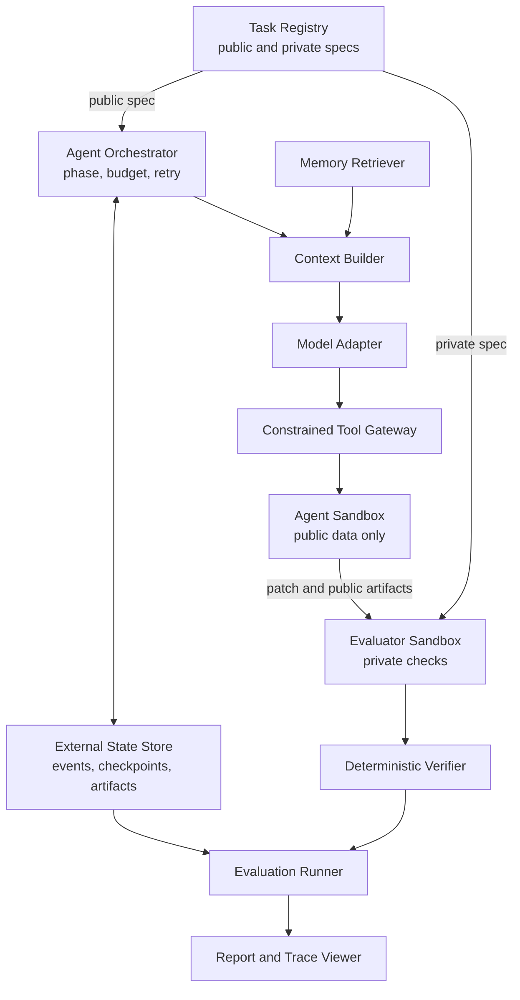
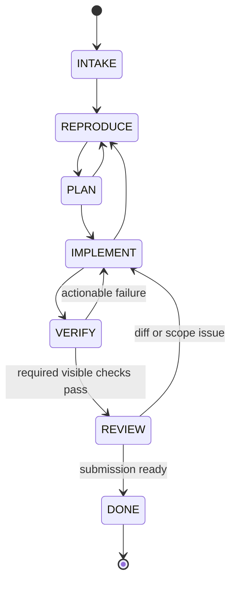

# Architecture

상태: **Normative draft**

## 1. Design principles

- Evaluation boundary를 agent loop보다 먼저 만든다.
- Source state, orchestration state, evaluator secret을 물리적으로 분리한다.
- 모든 중요한 판단은 event, artifact, content hash로 추적 가능해야 한다.
- 자동화 가능한 평가는 deterministic code로 수행한다.
- Recovery는 transcript replay가 아니라 structured state와 idempotent action을 사용한다.
- Provider, database, UI는 교체 가능한 adapter이고 domain contract가 중심이다.

## 2. System context



### Trust boundaries

| Boundary | May access | Must not access |
| --- | --- | --- |
| Agent sandbox | public spec, target repo, visible checks, selected memory | private spec, hidden tests, reference patch, host secrets |
| Evaluator sandbox | submitted patch, clean base repo, private checks | model session, writable agent workspace |
| Orchestrator/state | run metadata, events, artifacts, budgets | hidden test content in model context |
| Report/viewer | sanitized trace and verifier outcome | secrets, hidden assertion bodies, credential values |

Private artifact는 조회 권한을 별도로 표시하며, generic event payload나 model-visible artifact에 복사하지 않는다.

## 3. Components

| Component | Responsibility | Key output |
| --- | --- | --- |
| Task Registry | Immutable task version과 public/private locator 관리 | Resolved task |
| Orchestrator | Phase, transition, retry, budget, stop condition | Phase events/artifacts |
| Context Builder | Transcript 대신 bounded structured context 구성 | Context manifest |
| Model Adapter | Provider 차이를 normalized request/result로 변환 | Model-call event |
| Tool Gateway | Schema, policy, stable action ID 검증 | Tool events/artifacts |
| Agent Sandbox | Repository read/write와 registered check 실행 | Patch/check output |
| State Store | Append-only events, checkpoints, artifact metadata | Durable run state |
| Evaluator | Clean checkout에 patch 적용 후 private 검증 | Verifier results |
| Failure Classifier | Evidence에서 cause/symptom 분리 | Failure record |
| Memory Store/Retriever | Versioned rule 저장, filter/rank/threshold | Retrieval decision |
| Eval Runner | Condition matrix 실행과 provenance 고정 | Raw result rows |
| Reporter | Metric 집계와 task-level evidence 연결 | JSON/CSV/HTML |

## 4. Agent state machine



| Phase | Required evidence before leaving |
| --- | --- |
| `INTAKE` | `task_summary.json` with issue and constraints |
| `REPRODUCE` | Reproducing command/output, explicit non-repro reason, or static evidence |
| `PLAN` | `plan.json` naming change targets and checks |
| `IMPLEMENT` | Patch or evidence-backed no-change decision |
| `VERIFY` | `verification.json` for every required visible check |
| `REVIEW` | `review.json` covering diff, scope, dependency and API risk |
| `DONE` | `final_report.json` and immutable submitted patch hash |

Invalid transition은 거부하고 event로 남긴다. `DONE`은 evaluator 성공을 뜻하지 않는다. Agent submission이 끝났다는 의미이며, 최종 outcome은 evaluator가 결정한다.

## 5. Tool surface

MVP agent-visible tool을 작게 유지한다.

| Tool | Purpose | Important constraint |
| --- | --- | --- |
| `list_tree` | bounded repository 탐색 | result count/depth 제한 |
| `search_repo` | text/symbol 검색 | path/glob/max result 필요 |
| `read_file` | line-bounded read | repository-relative path only |
| `apply_patch` | text-only raw Git unified diff 적용 | stable action ID와 path/scope policy 필요 |
| `run_check` | registered check 실행 | arbitrary command 금지 |
| `inspect_diff` | current diff와 정책 signal 확인 | state path 제외 |
| `write_checkpoint` | structured durable state 요청 | repository 밖에 저장 |
| `finish_task` | final submission control signal | required artifacts가 있어야 허용 |

`finish_task`는 shell/repository tool이 아니라 orchestrator control action이다.

## 6. Persistent state

Logical storage layout은 source repository와 분리한다.

```text
/workspaces/{run_id}/repo
/run-state/{run_id}/events
/run-state/{run_id}/artifacts
/run-state/{run_id}/checkpoints
/evaluator/tasks/{task_version}
```

구현 경로는 OS와 backend에 따라 달라도 이 논리적 분리를 보존해야 한다.

### Durability rules

- Event sequence는 run 안에서 단조 증가하고 unique하다.
- Event append와 해당 action outcome의 durable 기록 순서를 명시한다.
- Checkpoint는 이전 event sequence와 repository/patch hash를 참조한다.
- Artifact는 immutable content hash로 식별한다.
- 동일 action ID와 input hash의 완료 기록이 있으면 recovery에서 재실행하지 않는다.
- 중단된 action은 tool별 reconciliation 정책으로 completed/failed/unknown을 결정한다.

### Recovery algorithm

1. 마지막 valid event sequence와 checkpoint를 읽는다.
2. Checkpoint가 참조하는 event와 artifact hash를 검증한다.
3. Target repository HEAD, worktree diff, submitted patch hash를 비교한다.
4. 완료·진행 중·미실행 action을 분류한다.
5. 현재 phase와 budget을 복원한다.
6. Structured state로 새 context를 만든다.
7. 첫 미완료 action부터 실행한다.

## 7. Context construction

각 model call은 다음 section으로 이루어진 bounded context를 받는다.

```text
System policy
Public task specification
Current phase and transition requirements
Persistent task state
Relevant repository context
Current diff
Recent tool evidence
Selected failure memory
Remaining budget
Tool/output schema
```

초기 budget 기본안은 task/policy 15%, state 15%, repo 35%, recent evidence 15%, memory 10%, tool/output schema 10%다. 비율은 development set에서만 조정하고 held-out 전에 고정한다.

## 8. Evaluation path

1. Evaluator는 base commit에서 clean checkout을 만든다.
2. Immutable submitted patch를 적용한다.
3. Hidden acceptance와 regression을 agent와 다른 sandbox에서 실행한다.
4. Diff에서 path, file/line count, dependency, test tampering, API 정책을 검사한다.
5. Sandbox audit에서 safety violation을 검사한다.
6. 각 check를 독립 `VerifierResult`로 저장한다.
7. Primary success bit는 verifier 결과의 deterministic conjunction으로 계산한다.

Evaluator는 agent가 남긴 “통과했다”는 서술을 신뢰하지 않는다.

## 9. Sandbox baseline

```yaml
network: none
cpus: 2
memory: 2g
pids_limit: 128
read_only_root: true
writable_mounts:
  - /workspace/repo
  - /tmp
timeout_seconds: 900
secrets: none
```

Agent image와 evaluator image는 별도 digest로 versioning한다. Hidden task content는 agent image layer, mount, log에 존재해서는 안 된다.

## 10. Failure behavior

- Tool error, timeout, policy rejection을 model-visible structured result와 durable event 양쪽에 남긴다.
- Raw stdout/stderr가 잘리면 `truncated: true`, original byte count, artifact locator를 남긴다.
- 같은 normalized tool call이 연속 반복되면 loop signal을 발생시킨다.
- 분류할 수 없는 실패를 성공으로 바꾸지 않는다. `UNKNOWN` 또는 review-needed 상태와 evidence를 보존한다.
- Storage failure로 trace integrity를 보장할 수 없으면 run을 성공 처리하지 않는다.
