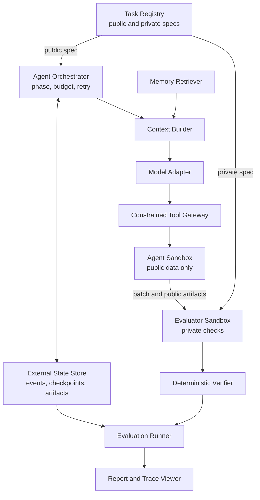
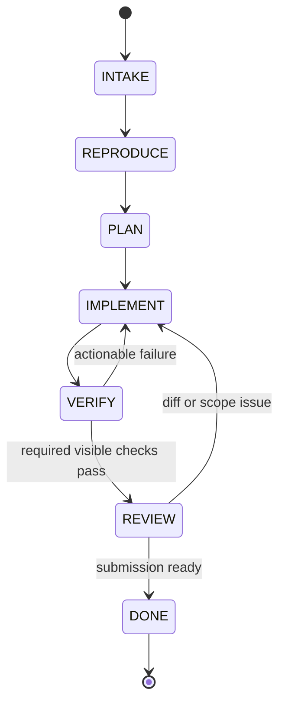

# Architecture

상태: **Normative draft**

## 1. Design principles

- Evaluation boundary를 agent loop보다 먼저 만든다.
- Source state, orchestration state, evaluator secret을 물리적으로 분리한다.
- 모든 중요한 판단은 event, artifact, content hash로 추적 가능해야 한다.
- 자동화 가능한 평가는 deterministic code로 수행한다.
- Recovery는 transcript replay가 아니라 structured state와 idempotent action을 사용한다.
- Provider, database, UI는 교체 가능한 adapter이고 domain contract가 중심이다.

## 2. System context



### Trust boundaries

| Boundary | May access | Must not access |
| --- | --- | --- |
| Agent sandbox | public spec, target repo, visible checks, selected memory | private spec, hidden tests, reference patch, host secrets |
| Evaluator sandbox | submitted patch, clean base repo, private checks | model session, writable agent workspace |
| Orchestrator/state | run metadata, events, artifacts, budgets | hidden test content in model context |
| Report/viewer | sanitized trace and verifier outcome | secrets, hidden assertion bodies, credential values |

Private artifact는 조회 권한을 별도로 표시하며, generic event payload나 model-visible artifact에 복사하지 않는다.

## 3. Components

| Component | Responsibility | Key output |
| --- | --- | --- |
| Task Registry | Immutable task version과 public/private locator 관리 | Resolved task |
| Orchestrator | Phase, transition, retry, budget, stop condition | Phase events/artifacts |
| Context Builder | Transcript 대신 bounded structured context 구성 | Context manifest |
| Model Adapter | Provider 차이를 normalized request/result로 변환 | Model-call event |
| Tool Gateway | Schema, policy, stable action ID 검증 | Tool events/artifacts |
| Agent Sandbox | Repository read/write와 registered check 실행 | Patch/check output |
| State Store | Append-only events, checkpoints, artifact metadata | Durable run state |
| Evaluator | Clean checkout에 patch 적용 후 private 검증 | Verifier results |
| Failure Classifier | Evidence에서 cause/symptom 분리 | Failure record |
| Memory Store/Retriever | Versioned rule 저장, filter/rank/threshold | Retrieval decision |
| Eval Runner | Condition matrix 실행과 provenance 고정 | Raw result rows |
| Reporter | Metric 집계와 task-level evidence 연결 | JSON/CSV/HTML |

## 4. Agent state machine



| Phase | Implemented transition trigger and durable evidence |
| --- | --- |
| `INTAKE` | Validated manifest와 `RunStarted` runtime-contract artifact |
| `REPRODUCE` | Successful non-empty `PatchApplied`; runner가 `PLAN`을 거쳐 `IMPLEMENT`로 전이 |
| `PLAN` | 위 mutation evidence에 결속된 `PhaseChanged`; 별도 plan file은 아직 없음 |
| `IMPLEMENT` | Current-diff visible check 성공 시 `VERIFY`로 전이 |
| `VERIFY` | 모든 required current-diff check 뒤 성공한 `get_diff` |
| `REVIEW` | Complete `get_diff`가 다음 request에 포함되고 `finish_task`가 acceptance를 통과 |
| `DONE` | `SubmissionAccepted`, immutable submitted-patch CAS artifact와 DONE checkpoint |

Invalid transition은 거부하고 event로 남긴다. `DONE`은 evaluator 성공을 뜻하지 않는다. Agent submission이 끝났다는 의미이며, 최종 outcome은 evaluator가 결정한다.

새 v2 run의 phase는 model이 선언하는 상태가 아니라 성공한 tool evidence에서만 전이된다.
`apply_patch`가 실패하면 `REPRODUCE`/현재 phase에 남고, patch 성공은 이전 check와 review를
무효화한다. 현재 diff가 과거 hash로 돌아와도 마지막 `PatchApplied` 이전 evidence는
새 mutation epoch에서 재사용하지 않는다. `run_check`와 `get_diff` 결과에는 exact `worktree_diff_hash`가 들어간다.
현재 diff와 일치하는 non-empty `PatchApplied`가 없으면 base check와 empty `get_diff`가
성공했더라도 제출할 수 없다.
모든 required check의 최신 current-diff 결과가 pass한 뒤 실행된 `get_diff`만 REVIEW
candidate가 되며, 그 complete result가 다음 model request에 실제 포함됐을 때만
`finish_task`가 accepted patch bytes를 CAS에 동결하고 `REVIEW → DONE`을 허용한다.
Evaluator는 mutable workspace를 다시 직렬화하지 않고 그 accepted artifact를 입력으로 쓴다.

## 5. Tool surface

MVP agent-visible tool을 작게 유지한다.

| Tool | Purpose | Important constraint |
| --- | --- | --- |
| `search_files` | literal text 검색 | repository-relative safe glob, result limit |
| `read_file` | line-bounded read | repository-relative path only |
| `apply_patch` | 기존 tracked text file에 raw Git unified diff 적용 | hunk count만 recount; stable action ID, zero-untracked와 path/scope policy 필요 |
| `run_check` | registered check 실행 | arbitrary command 금지, result를 current diff에 결속 |
| `get_diff` | current diff와 size summary 확인 | check 뒤의 final review evidence |
| `finish_task` | final submission control signal | current-diff check와 model-visible final diff review 필요 |

Checkpoint 저장은 runner 내부 동작이며 agent tool이 아니다. `finish_task`도
shell/repository tool이 아니라 orchestrator control action이다.

Agent-visible `apply_patch`는 model이 만든 hunk header의 old/new line total만 body에서
재계산한다. Patch body 문법, context와 path matching은 Git이 그대로 검사하며
deterministic verifier도 완화하지 않는다. v2는 intent의 검증된 preimage로 policy reject를
rollback하고 pre-call diff hash를 재확인한다. Legacy v1만 같은 raw patch를 reverse
recount한다. Rollback 실패, 복원 불일치 또는 agent workspace의 untracked file은 recovery
error로 run을 중단한다. 이 호환 계층은 agent gateway에만 있으며 hidden evaluator와
fixture evaluator의 patch 적용은 strict하다.

## 6. Persistent state

Logical storage layout은 source repository와 분리한다.

```text
/workspaces/{run_id}/repo
/run-state/{run_id}/events
/run-state/{run_id}/artifacts
/run-state/{run_id}/checkpoints
/evaluator/tasks/{task_version}
```

구현 경로는 OS와 backend에 따라 달라도 이 논리적 분리를 보존해야 한다.

### Durability rules

- Event sequence는 run 안에서 단조 증가하고 unique하다.
- Event append와 해당 action outcome의 durable 기록 순서를 명시한다.
- Checkpoint는 이전 event sequence와 repository/patch hash를 참조한다.
- Artifact는 immutable content hash로 식별한다. 새 object는 같은 directory의 temporary
  file을 fsync한 뒤 atomic replace하고, 기존 object는 재사용 전에 bytes hash를 검증한다.
- 동일 action ID와 input hash의 완료 기록이 있으면 recovery에서 재실행하지 않는다.
- 중단된 action은 tool별 reconciliation 정책으로 completed/failed/unknown을 결정한다.
- Run 전체 lifetime에는 Windows/Linux kernel advisory lock을 하나 유지한다. Lock을 얻은
  worker만 SQLite status를 `RUNNING`으로 claim할 수 있고, 살아 있는 owner와 경쟁한
  resume은 run event/status를 바꾸지 않고 `RUN_OWNERSHIP_CONFLICT`로 끝난다. OS process가
  죽으면 lock은 커널이 해제하며 다음 process는 stale `RUNNING`을 원자적으로 reclaim한다.
- v2 patch는 `ToolCalled(raw patch CAS) → PatchPrepared(pre/post image CAS) → mutation →
  action result/ToolSucceeded/PatchApplied atomic transaction` 순서를 사용한다. Recovery는
  모든 target이 pre면 한 번 적용하고, post면 재적용하지 않으며, mixed면 검증된 preimage로
  baseline을 복원한 뒤 한 번 적용한다. Unknown state나 CAS 손상은 fail-closed한다.
- `read_file`, `search_files`, `run_check`, `get_diff`도 v2에서는 normalized input CAS를
  먼저 기록한다. Outcome 없이 중단되면 workspace가 checkpoint와 정확히 같은지 확인한 뒤
  원래 `ToolCalled`를 재사용해 `ToolSucceeded`/`ToolFailed`로 닫는다. 이미 durable result가
  있는 v2 action을 같은 identity로 다시 호출한 cache hit만 `ToolReplayed`를 남긴다.
- Managed workspace는 정확한 `{workspace_root}/{run_id}/repo` layout, symlink/junction 부재와
  resolved-root containment를 매 recovery 전에 검증한다. Worktree evidence는 staged와
  unstaged tracked 변경을 함께 포함하는 `git diff HEAD`다.
- Evaluator는 manifest/result/provenance와 verifier evidence CAS를 완성한 뒤 hash-bound
  evaluation receipt를 기록한다. 완전한 receipt만 재사용하며, `FailureTagged?`,
  terminal event, result와 status는 한 SQLite transaction으로 확정한다.
- `finish_task`는 correlation별 lifecycle prefix와 durable recovery result를 대조해
  누락 suffix, DONE transition과 checkpoint event만 보충한다.

### Recovery algorithm

1. Per-run OS lock을 얻고, 최초 start는 manifest insert와 `CREATED → RUNNING`을 한
   transaction으로 처리한다. Resume은 `CREATED | SUSPENDED | RUNNING → RUNNING` claim을
   원자적으로 남긴다.
2. 마지막 valid event sequence와 checkpoint를 읽는다.
3. Checkpoint가 참조하는 event와 artifact hash를 검증한다.
4. Target repository HEAD와 중단된 patch의 pre/post image를 먼저 대조한다.
5. 중단된 patch가 없다면 generic action 재실행이나 checkpoint 승격 전에 현재
   `git diff HEAD`가 마지막 checkpoint와 정확히 같은지 확인한다.
6. Patch outcome/phase/checkpoint의 누락된 durable suffix를 보충한다.
7. 최종 worktree diff와 checkpoint, submitted patch hash를 비교한다.
8. 현재 phase와 budget을 복원한다.
9. Structured state로 새 context를 만들고 첫 미완료 action부터 실행한다.

## 7. Context construction

각 model call은 다음 section으로 이루어진 bounded context를 받는다.

```text
System policy
Public task specification
Current phase and transition requirements
Persistent task state
Relevant repository context
Current diff
Recent tool evidence
Selected failure memory
Remaining budget
Tool/output schema
```

초기 budget 기본안은 task/policy 15%, state 15%, repo 35%, recent evidence 15%, memory 10%, tool/output schema 10%다. 비율은 development set에서만 조정하고 held-out 전에 고정한다.

## 8. Evaluation path

1. Evaluator는 base commit에서 clean checkout을 만든다.
2. Immutable submitted patch를 적용한다.
3. Hidden acceptance와 regression을 agent와 다른 sandbox에서 실행한다.
4. Diff에서 path, file/line count, dependency, test tampering, API 정책을 검사한다.
5. Sandbox audit에서 safety violation을 검사한다.
6. 각 check를 독립 `VerifierResult`로 저장한다.
7. Primary success bit는 verifier 결과의 deterministic conjunction으로 계산한다.

Evaluator는 agent가 남긴 “통과했다”는 서술을 신뢰하지 않는다.

## 9. Sandbox baseline

```yaml
network: none
cpus: 2
memory: 2g
pids_limit: 128
read_only_root: true
writable_mounts:
  - /workspace/repo
  - /tmp
timeout_seconds: 900
secrets: none
```

Agent image와 evaluator image는 별도 digest로 versioning한다. Hidden task content는 agent image layer, mount, log에 존재해서는 안 된다.

## 10. Failure behavior

- Tool error, timeout, policy rejection을 model-visible structured result와 durable event 양쪽에 남긴다.
- Raw stdout/stderr가 잘리면 `truncated: true`, original byte count, artifact locator를 남긴다.
- 같은 normalized tool call이 연속 반복되면 loop signal을 발생시킨다.
- 일반 반복은 `LoopDetected(enforcement=advisory)`로, 최근-event window에서 밀려나도
  현재 model turn의 signal을 별도 `execution_signals`에 넣어 다음 context에 제공한다. 동일한
  timed-out registered check는 다시 실행하지 않고 structured environment failure로 종료한다.
- 제출 조건 미충족은 `SubmissionRejected`와 model-visible tool result로 돌려주며 두 번까지
  복구할 수 있다. 세 번째 rejection은 deterministic `premature-stop`이다.
- Registered check가 tracked worktree를 바꾸면 `ToolFailed` artifact와 usage를 먼저
  닫은 뒤 infrastructure recovery error로 종료한다.
- 분류할 수 없는 실패를 성공으로 바꾸지 않는다. `UNKNOWN` 또는 review-needed 상태와 evidence를 보존한다.
- Storage failure로 trace integrity를 보장할 수 없으면 run을 성공 처리하지 않는다.
