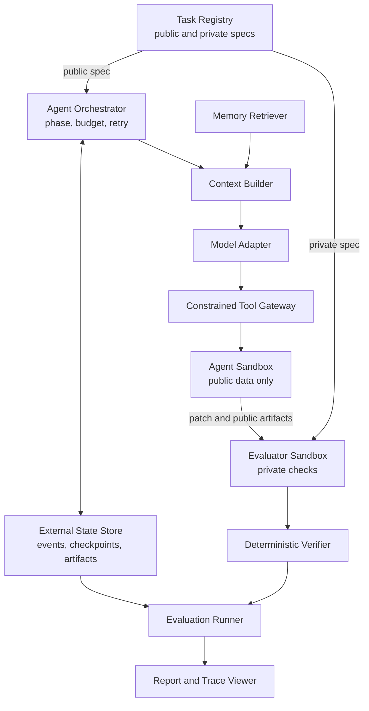
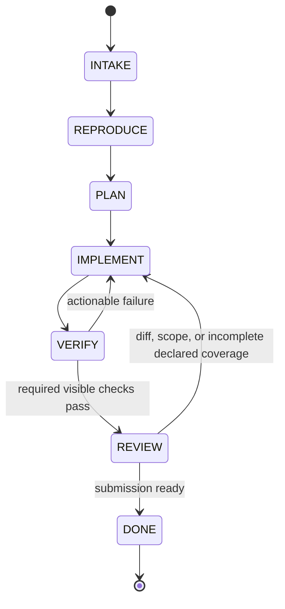

# Architecture

상태: **Normative draft**

## 1. Design principles

- Evaluation boundary를 agent loop보다 먼저 만든다.
- Source state, orchestration state, evaluator secret을 물리적으로 분리한다.
- 모든 중요한 판단은 event, artifact, content hash로 추적 가능해야 한다.
- 자동화 가능한 평가는 deterministic code로 수행한다.
- Recovery는 transcript replay가 아니라 structured state와 idempotent action을 사용한다.
- Provider, database, UI는 교체 가능한 adapter이고 domain contract가 중심이다.

## 2. System context



### Trust boundaries

| Boundary | May access | Must not access |
| --- | --- | --- |
| Agent sandbox | public spec, target repo, visible checks, selected memory | private spec, hidden tests, reference patch, host secrets |
| Evaluator sandbox | submitted patch, clean base repo, private checks | model session, writable agent workspace |
| Orchestrator/state | run metadata, events, artifacts, budgets | hidden test content in model context |
| Report/viewer | sanitized trace and verifier outcome | secrets, hidden assertion bodies, credential values |

Private artifact는 조회 권한을 별도로 표시하며, generic event payload나 model-visible artifact에 복사하지 않는다.

## 3. Components

| Component | Responsibility | Key output |
| --- | --- | --- |
| Task Registry | Immutable task version과 public/private locator 관리 | Resolved task |
| Orchestrator | Phase, transition, retry, budget, stop condition | Phase events/artifacts |
| Context Builder | Transcript 대신 bounded structured context 구성 | Context manifest |
| Model Adapter | Provider 차이를 normalized request/result로 변환 | Model-call event |
| Tool Gateway | Schema, policy, stable action ID 검증 | Tool events/artifacts |
| Agent Sandbox | Repository read/write와 registered check 실행 | Patch/check output |
| State Store | Append-only events, checkpoints, artifact metadata | Durable run state |
| Evaluator | Clean checkout에 patch 적용 후 private 검증 | Verifier results |
| Failure Classifier | Evidence에서 cause/symptom 분리 | Failure record |
| Memory Store/Retriever | Versioned rule 저장, filter/rank/threshold | Retrieval decision |
| Eval Runner | Condition matrix 실행과 provenance 고정 | Raw result rows |
| Reporter | Metric 집계와 task-level evidence 연결 | JSON/CSV/HTML |

## 4. Agent state machine



| Phase | Implemented transition trigger and durable evidence |
| --- | --- |
| `INTAKE` | Validated manifest와 `RunStarted` runtime-contract artifact |
| `REPRODUCE` | Successful non-empty `PatchApplied`; runner가 `PLAN`을 거쳐 `IMPLEMENT`로 전이 |
| `PLAN` | 위 mutation evidence에 결속된 `PhaseChanged`; 별도 plan file은 아직 없음 |
| `IMPLEMENT` | Current-diff visible check 성공 시 `VERIFY`로 전이 |
| `VERIFY` | 모든 required current-diff check 뒤 성공한 `get_diff` |
| `REVIEW` | V1-V9은 각 version의 complete `get_diff`와, 해당 version이 요구하는 경우 structured review를 따른다. Opt-in V10/V11은 선언된 모든 public coverage target이 verified인 same-diff `task-review-v3`까지 요구하며 partial review는 `IMPLEMENT`로 되돌린다. V11 target citation rejection은 restart-safe structured feedback을 남긴다. |
| `DONE` | `SubmissionAccepted`, immutable submitted-patch CAS artifact와 DONE checkpoint |

Invalid transition은 거부하고 event로 남긴다. `DONE`은 evaluator 성공을 뜻하지 않는다. Agent submission이 끝났다는 의미이며, 최종 outcome은 evaluator가 결정한다.

새 v2 run의 phase는 model이 선언하는 상태가 아니라 성공한 tool evidence에서만 전이된다.
`apply_patch`가 실패하면 `REPRODUCE`/현재 phase에 남고, patch 성공은 이전 check와 review를
무효화한다. 현재 diff가 과거 hash로 돌아와도 마지막 `PatchApplied` 이전 evidence는
새 mutation epoch에서 재사용하지 않는다. `run_check`와 `get_diff` 결과에는 exact `worktree_diff_hash`가 들어간다.
현재 diff와 일치하는 non-empty `PatchApplied`가 없으면 base check와 empty `get_diff`가
성공했더라도 제출할 수 없다.
모든 required check의 최신 current-diff 결과가 pass한 뒤 실행된 `get_diff`만 REVIEW
candidate가 되며, 그 complete result가 다음 model request에 실제 포함됐을 때만
`finish_task`가 accepted patch bytes를 CAS에 동결하고 `REVIEW → DONE`을 허용한다.
Evaluator는 mutable workspace를 다시 직렬화하지 않고 그 accepted artifact를 입력으로 쓴다.

## 5. Tool surface

MVP agent-visible tool을 작게 유지한다.

| Tool | Purpose | Important constraint |
| --- | --- | --- |
| `search_files` | literal text 검색 | repository-relative safe glob, result limit |
| `read_file` | line-bounded read | repository-relative path only |
| `apply_patch` | 기존 tracked text file에 raw Git unified diff 적용 | hunk count만 recount; stable action ID, zero-untracked와 path/scope policy 필요 |
| `run_check` | registered check 실행 | arbitrary command 금지, result를 current diff에 결속 |
| `get_diff` | current diff와 size summary 확인 | check 뒤의 final review evidence |
| `finish_task` | final submission control signal | current-diff check와 model-visible final diff review 필요; V10/V11은 exact public target coverage도 완료돼야 함 |

Checkpoint 저장은 runner 내부 동작이며 agent tool이 아니다. `finish_task`도
shell/repository tool이 아니라 orchestrator control action이다.

D-056의 opt-in v3 surface는 위 v2 surface를 그대로 두고 다음 두 도구만 추가한다.

| Tool | Purpose | Important constraint |
| --- | --- | --- |
| `run_probe` | 공개 issue에서 도출한 일회성 Python probe 실행 | `task-public-v2` registered profile + dedicated clean Docker image only, repository read-only, network/secrets 없음, source는 repository 밖 CAS에 보존; optional이고 authoritative check가 아님 |
| `review_task` | 현재 diff에 대한 requirement·targeted validation·residual risk 자기점검 기록 | current-diff check/diff 및 같은 request의 공개 evidence만 인용; inspectable self-attestation이지 grader가 아님 |

`run_probe`는 새 test file을 checkout에 만들지 않고 stdin으로 실행한다. Task evaluator
image를 재사용하지 않는 repository-free `patchloop-sandbox:py312`의 exact image ID를
manifest에 결속한다. Mutable tag는 precheck에만 쓰고 container는 그 immutable ID로
`create`한 뒤 실제 `.Image` equality를 확인해야만 start한다. Nested tmpfs로
`/workspace/.git`을 가려 future commit이나 Git object를 solution shortcut으로 읽지
못하게 한다. Gateway AST policy와 bootstrap audit hook은 흔한 process/native/dynamic
호출을 조기에 거부하는 defense-in-depth이며 Python reflection 자체의 security boundary로
간주하지 않는다. Trusted PID 1은 source를 compile한 뒤 untrusted child를 한 번 fork하고,
그 child에 `no_new_privs`와 seccomp BPF를 설치해 fork/clone/exec, parent signal과 process
trace syscall을 kernel에서 `EPERM`으로 막는다. PID cgroup도 parent+child 두 개로 제한한다.
Proxy 환경을 비우고 trusted parent watchdog·stale-container cleanup을 사용한다. 따라서
target repository의 scope를 늘리거나 patch에 diagnostic file을 남기지 않는다. Local
backend, 미등록 profile, 비정상 `.git` metadata와 image identity 불일치는 start 전에
fail closed한다.
Probe pass는 registered check pass를 대신하지 않고, probe 사용 자체도 제출의 필수조건이
아니다. `review_task`는 `phase-evidence-v6`에서 final `get_diff` 뒤, 같은 diff에 대한
공개 validation evidence를 인용해야 한다. Canonical review 본문과 receipt가 다음
`finish_task` request에 완전하게 제시돼야 제출 가능하지만, review 내용이 옳다는 자기
선언만으로 evaluator verdict를 만들지는 않는다.

Agent-visible `apply_patch`는 model이 만든 hunk header의 old/new line total만 body에서
재계산한다. Patch body 문법, context와 path matching은 Git이 그대로 검사하며
deterministic verifier도 완화하지 않는다. v2는 intent의 검증된 preimage로 policy reject를
rollback하고 pre-call diff hash를 재확인한다. Legacy v1만 같은 raw patch를 reverse
recount한다. Rollback 실패, 복원 불일치 또는 agent workspace의 untracked file은 recovery
error로 run을 중단한다. 이 호환 계층은 agent gateway에만 있으며 hidden evaluator와
fixture evaluator의 patch 적용은 strict하다.

## 6. Persistent state

Logical storage layout은 source repository와 분리한다.

```text
/workspaces/{run_id}/repo
/run-state/{run_id}/events
/run-state/{run_id}/artifacts
/run-state/{run_id}/checkpoints
/evaluator/tasks/{task_version}
```

구현 경로는 OS와 backend에 따라 달라도 이 논리적 분리를 보존해야 한다.

### Durability rules

- Event sequence는 run 안에서 단조 증가하고 unique하다.
- Event append와 해당 action outcome의 durable 기록 순서를 명시한다.
- Checkpoint는 이전 event sequence와 repository/patch hash를 참조한다.
- Artifact는 immutable content hash로 식별한다. 새 object는 같은 directory의 temporary
  file을 fsync한 뒤 atomic replace하고, 기존 object는 재사용 전에 bytes hash를 검증한다.
- 동일 action ID와 input hash의 완료 기록이 있으면 recovery에서 재실행하지 않는다.
- 중단된 action은 tool별 reconciliation 정책으로 completed/failed/unknown을 결정한다.
- Run 전체 lifetime에는 Windows/Linux kernel advisory lock을 하나 유지한다. Lock을 얻은
  worker만 SQLite status를 `RUNNING`으로 claim할 수 있고, 살아 있는 owner와 경쟁한
  resume은 run event/status를 바꾸지 않고 `RUN_OWNERSHIP_CONFLICT`로 끝난다. OS process가
  죽으면 lock은 커널이 해제하며 다음 process는 stale `RUNNING`을 원자적으로 reclaim한다.
- v2 patch는 `ToolCalled(raw patch CAS) → PatchPrepared(pre/post image CAS) → mutation →
  action result/ToolSucceeded/PatchApplied atomic transaction` 순서를 사용한다. Recovery는
  모든 target이 pre면 한 번 적용하고, post면 재적용하지 않으며, mixed면 검증된 preimage로
  baseline을 복원한 뒤 한 번 적용한다. Unknown state나 CAS 손상은 fail-closed한다.
- `read_file`, `search_files`, `run_check`, `get_diff`도 v2에서는 normalized input CAS를
  먼저 기록한다. Outcome 없이 중단되면 workspace가 checkpoint와 정확히 같은지 확인한 뒤
  원래 `ToolCalled`를 재사용해 `ToolSucceeded`/`ToolFailed`로 닫는다. 이미 durable result가
  있는 v2 action을 같은 identity로 다시 호출한 cache hit만 `ToolReplayed`를 남긴다.
- Managed workspace는 정확한 `{workspace_root}/{run_id}/repo` layout, symlink/junction 부재와
  resolved-root containment를 매 recovery 전에 검증한다. Worktree evidence는 staged와
  unstaged tracked 변경을 함께 포함하는 `git diff HEAD`다.
- Evaluator는 manifest/result/provenance와 verifier evidence CAS를 완성한 뒤 hash-bound
  evaluation receipt를 기록한다. 완전한 receipt만 재사용하며, `FailureTagged?`,
  terminal event, result와 status는 한 SQLite transaction으로 확정한다.
- `finish_task`는 correlation별 lifecycle prefix와 durable recovery result를 대조해
  누락 suffix, DONE transition과 checkpoint event만 보충한다.
- `phase-evidence-v3` context builder는 최신 model turn 뒤 rejected `apply_patch`의
  correlated candidate/result CAS를 외부 run state에서 다시 검증하고, exact candidate와
  structured reason을 첫 후속 request에만 넣는다. 이 bytes는 checkpoint나 대상 repository에
  복사하지 않는다. Full request와 output allowance가 token budget을 넘으면 request CAS와
  `ModelGenerationBlocked`를 남기고 provider generation 전에 fail-closed한다.
- `phase-evidence-v4`는 v3를 상속하면서 active mutation epoch의 successful read/search
  input·result CAS를 `investigation-ledger-v1`로 매 turn 재계산한다. Checkpoint에 별도
  mutable ledger를 저장하지 않으므로 context reset과 worker restart가 같은 append-only
  evidence를 다시 소비한다. Exact search와 fully-covered read는 source CAS body를
  `ToolReplayed`로 다시 제시하며 underlying filesystem dispatch를 생략한다.
- V4 tail admission은 남은 model/tool call이 nominal corrective lifecycle에 도달하면
  read/search만 `ToolAdmissionBlocked`로 gateway dispatch 전에 닫는다. Mutation,
  registered check, final diff와 submission action은 이 정책의 차단 대상이 아니다.
- `phase-evidence-v5`는 durable `ModelCalled` telemetry로 token-aware nominal corrective
  tail을 계산한다. 관찰 input은 `requested_input_tokens`를 우선하고 그 값이 `None`일
  때만 actual `input_tokens`로 fallback하며 invalid 값은 fail closed한다. 다음 input은
  `max(observed input) + max(positive consecutive growth)`로 예측한다. 현재 generation이
  기록되기 전에는 5 turn, 기록된 뒤에는 4 turn을 사용하고
  `reserved_tokens = max_output_tokens + projected_next_input × projected_turns`로
  예약한다. `remaining_tokens <= reserved_tokens`이면 read/search만
  `ToolAdmissionBlocked(tool-admission-blocked-v2, reason=token_tail_reserved)`로
  `ToolCalled`와 filesystem dispatch 전에 닫는다. Apply/check/diff/finish는 계속
  사용할 수 있다.
- V5 token cutoff는 completion guarantee가 아닌 nominal policy다. 각 generation 직전의
  strict exact-request + full 25,000 response allowance admission은 그대로 유지되므로,
  cutoff 뒤에도 exact request가 남은 total budget에 맞지 않으면 provider call 없이
  terminal block으로 끝날 수 있다. V5 evidence는 `investigation-policy-v2`,
  `investigation-ledger-v2`, `investigation-tail-policy-v2`,
  `context-build-evidence-v5`, `tool-admission-blocked-v2`,
  `trace-source-evidence-v5`로 versioning하고 qualification envelope은
  `trace-qualification-v2`를 유지한다.
- Opt-in `phase-evidence-v6`는 V5를 상속하고 tool schema v3의 probe/review evidence를
  external run state에 보존한다. Probe source·stdout·stderr와 review input/result는
  content hash로 결속하고 private evaluator artifact를 참조할 수 없다. Final submission은
  same-diff final `get_diff`와 그 결과를 실제로 본 `review_task`, 그리고 review result를
  실제로 본 `finish_task` 순서를 요구한다. 이 경로는 D-056 offline gate가 완료되기 전에는
  provider나 campaign에서 선택할 수 없다.
- D-041 r5에서도 generation admission은 exact input과 full per-call allowance가 남은 total
  budget에 함께 들어가야 한다는 strict rule을 유지한다. 새 exact-request no-generation
  event payload는 `model-generation-block-v1`로 versioning한다. 이 versioned terminal block은 retry
  candidate가 없어도 request, recomputed budget과 terminal result가 모두 결속되면 valid
  trace evidence지만, rejected-patch retry episode 또는 D-037 gate evidence는 아니다.
  Historical unversioned retry block은 읽기 호환하고, unversioned generic r4 block은 당시
  qualification 21/22로 immutable하게 유지한다.
- D-043 r6 controlled diagnostic은 profile v4 manifest에서만 첫
  `PatchPrepared` 뒤 mutation 전 `CONTROLLED_DIAGNOSTIC_REJECTION`을 한 번 만든다. Trigger
  여부는 process memory가 아니라 durable controlled `ToolFailed`에서 판단한다. Prepared
  intent 뒤 process가 죽어도 recovery는 verified pre-state를 적용하지 않고 같은 rejection
  result로 닫는다. 이 branch는 public `inject-fault`와 stress/core 경로에는 노출하지 않는다.

### Recovery algorithm

1. Per-run OS lock을 얻고, 최초 start는 manifest insert와 `CREATED → RUNNING`을 한
   transaction으로 처리한다. Resume은 `CREATED | SUSPENDED | RUNNING → RUNNING` claim을
   원자적으로 남긴다.
2. 마지막 valid event sequence와 checkpoint를 읽는다.
3. Checkpoint가 참조하는 event와 artifact hash를 검증한다.
4. Target repository HEAD와 중단된 patch의 pre/post image를 먼저 대조한다.
5. 중단된 patch가 없다면 generic action 재실행이나 checkpoint 승격 전에 현재
   `git diff HEAD`가 마지막 checkpoint와 정확히 같은지 확인한다.
6. Patch outcome/phase/checkpoint의 누락된 durable suffix를 보충한다.
7. 최종 worktree diff와 checkpoint, submitted patch hash를 비교한다.
8. 현재 phase와 budget을 복원한다.
9. Structured state로 새 context를 만들고 첫 미완료 action부터 실행한다.

## 7. Context construction

각 model call은 다음 section으로 이루어진 bounded context를 받는다.

```text
System policy
Public task specification
Current phase and transition requirements
Persistent task state
Relevant repository context
Current diff
Recent tool evidence
Selected failure memory
Remaining budget
Tool/output schema
```

초기 budget 기본안은 task/policy 15%, state 15%, repo 35%, recent evidence 15%, memory 10%, tool/output schema 10%다. 비율은 development set에서만 조정하고 held-out 전에 고정한다.

## 8. Evaluation path

1. Evaluator는 base commit에서 clean checkout을 만든다.
2. Immutable submitted patch를 적용한다.
3. Hidden acceptance와 regression을 agent와 다른 sandbox에서 실행한다.
4. Diff에서 path, file/line count, dependency, test tampering, API 정책을 검사한다.
5. Sandbox audit에서 safety violation을 검사한다.
6. 각 check를 독립 `VerifierResult`로 저장한다.
7. Primary success bit는 verifier 결과의 deterministic conjunction으로 계산한다.

Evaluator는 agent가 남긴 “통과했다”는 서술을 신뢰하지 않는다.

## 9. Sandbox baseline

```yaml
network: none
cpus: 2
memory: 2g
pids_limit: 128
read_only_root: true
writable_mounts:
  - /workspace/repo
  - /tmp
timeout_seconds: 900
secrets: none
```

Agent image와 evaluator image는 별도 digest로 versioning한다. Hidden task content는 agent image layer, mount, log에 존재해서는 안 된다.

## 10. Failure behavior

- Tool error, timeout, policy rejection을 model-visible structured result와 durable event 양쪽에 남긴다.
- Raw stdout/stderr가 잘리면 `truncated: true`, original byte count, artifact locator를 남긴다.
- V1-v3에서 같은 normalized tool call이 연속 반복되면 advisory loop signal을 발생시킨다.
- 일반 반복은 `LoopDetected(enforcement=advisory)`로, 최근-event window에서 밀려나도
  현재 model turn의 signal을 별도 `execution_signals`에 넣어 다음 context에 제공한다. 동일한
  timed-out registered check는 다시 실행하지 않고 structured environment failure로 종료한다.
- Historical V4는 active mutation epoch 전체에서 비연속 exact search와 interval-union으로 완전히
  덮인 read도 감지한다. `investigation-loop-v1`과 exact semantic replay를 남기며 두 번째
  연속 no-progress부터 strategy change를 요구한다. 새로운 query나 uncovered range를
  hard block하지 않는다.
- Current V5는 위 반복 evidence에 token projection을 더한다. Cutoff 전에는 V4 semantic
  replay 의미를 유지하고, cutoff 뒤 valid read/search는 `token_tail_reserved` evidence로
  admission 단계에서 닫아 tool budget과 filesystem dispatch를 소비하지 않는다.
- 제출 조건 미충족은 `SubmissionRejected`와 model-visible tool result로 돌려주며 두 번까지
  복구할 수 있다. 세 번째 rejection은 deterministic `premature-stop`이다.
- Registered check가 tracked worktree를 바꾸면 `ToolFailed` artifact와 usage를 먼저
  닫은 뒤 infrastructure recovery error로 종료한다.
- 분류할 수 없는 실패를 성공으로 바꾸지 않는다. `UNKNOWN` 또는 review-needed 상태와 evidence를 보존한다.
- Storage failure로 trace integrity를 보장할 수 없으면 run을 성공 처리하지 않는다.

## 11. D-062 corrective runtime boundary

`tool_schema_version=v4`와 `context_policy_version=phase-evidence-v7`은 새 corrective
pilot에서만 pair로 사용한다. Historical v1-v6 run은 소급 재해석하지 않는다.

`corrective-runtime-contract-v1`은 v4/v7 pair, exact system-prompt hash, tool-schema hash와
harness commit을 corrective purpose의 execution hash와 plan에만 조건부로 포함한다. Manifest
validation과 AgentRunner start/resume가 이 contract를 강제하고, qualifier는 unique runner
`RunStarted`가 가리키는 full artifact descriptor, task/role/path와 CAS bytes를 다시 검증한다.
따라서 plan이나 manifest version을 낮춰 새 review/barrier check를 우회하거나 다른 prompt/tool
artifact를 같은 approval로 소비할 수 없다. Historical execution-hash payload에는 이 필드를
추가하지 않는다.

- Context builder는 task ID/version/hash만 보지 않고 각 checklist excerpt가 normalized
  public issue description의 실제 substring인지 다시 검증한 뒤에만 model request에 넣는다.
- Rejected `apply_patch`는 patch CAS와 bounded source snapshot을 다음 apply outcome까지
  유지한다. Successful/rejected next apply가 episode를 닫기 전에는 다른 turn에서도
  candidate/reason이 사라지지 않는다.
- 한 model response의 첫 `apply_patch`는 turn barrier다. 뒤의 모든 call은 dispatch하지
  않고 `ToolAdmissionBlocked(turn-mutation-barrier-v1)`로 닫는다. Apply outcome 뒤 process가
  죽으면 resume이 model response CAS를 검증하고 누락 barrier suffix를 idempotently 보충한다.
- Active mutation epoch에서 exact search/fully-covered read semantic replay가 6회 누적되면
  추가 read/search를 `evidence_saturated`로 닫는다. 새 successful patch가 epoch와 counter를
  reset한다. Apply/check/diff/review/finish는 이 제한의 대상이 아니다.

이 정책은 탐색 비용을 줄이는 condition-neutral runtime 보정이다. Cross-run memory가 아니며
task 성공 또는 completion을 보장하지 않는다.

D-062 live campaign은 승인 execution hash
`sha256:464a6eca2597698ca35caa4d7c97173f1af792daec042c36d81b5b8189ae4031`로 정확히 한 번
실행됐다. 첫 HF Hub run `run_0ccfc8fd359a4785`은 33개 completed model call과 875,908
token을 사용한 뒤 exact-request budget admission에서 종료됐다. Active epoch saturation은
gateway에서 read/search 30회를 차단했지만 v7 context의 `phase_contract.allowed_next_actions`와
`investigation_exploration_admitted`는 token-tail이 닫히기 전까지 read/search를 계속
광고했다. 그 뒤 일곱 raw diff가 모두 preview에서 거부돼 `PatchPrepared`와 `PatchApplied`는
발생하지 않았고 evaluator도 실행되지 않았다. 이 관찰은 saturation enforcement와
model-visible phase contract를 같은 prefix에서 합성해야 한다는 새 version 필요성을
보여주며, v7 rendering을 소급 변경하는 근거가 아니다.

Original campaign result, hash-chained journal과 qualification artifact는 immutable하다.
Original qualification failure로 campaign이 fail-closed했기 때문에 나머지 PDM/pyfakefs
row는 시작되지 않았고 original gate는 false다. 독립 분석에서 qualifier의 v5-vs-v6/v7
reserve-version drift가 분리됐고, 별도 `trace-qualification-correction-v1`
`qcor_8b6ff812...4870b6`가 corrected trace integrity를 통과했다. Canonical qualification과
campaign result는 수정하지 않았으므로 original gate와 task outcome은 그대로다.
D-062는 계속하거나 재실행하지 않는다. 다음 architecture gate는 새 `phase-evidence-v8`
saturation-context 계약을 offline에서 검증한 뒤 별도 승인된 single live pilot으로 확인하는
것이다.

## 12. D-063 saturation-context boundary

`phase-evidence-v8`은 D-062에서 관찰된 gateway/context 불일치만 분리해 수정한다. Tool
surface와 prompt는 각각 `tool_schema_version=v4`, `SYSTEM_PROMPT_V5`를 그대로 사용하고,
model-visible phase contract만 `phase-contract-v3`로 올린다. Historical v7 request와
qualification은 다시 렌더링하지 않는다.

V8 context builder는 durable event prefix에서 마지막 successful `PatchApplied`를 active
mutation epoch로 잡고, 그 뒤의 `ToolReplayed(semantic_replay=true)`를 센다. 이 값과 기존
token/model/tool tail 정책을 다음 `read_search_policy`로 합성한다.

```json
{
  "schema_version": "read-search-policy-v1",
  "policy_version": "evidence-saturation-v1",
  "admitted": false,
  "reason_codes": ["evidence_saturated"],
  "semantic_replay_count": 6,
  "semantic_replay_threshold": 6,
  "mutation_epoch_sequence": null
}
```

Tail reason을 먼저 기록하고 replay count가 6 이상이면 `evidence_saturated`를 뒤에 붙인다.
Saturation만 활성화되면 `read_file`과 `search_files`만 authoritative
`allowed_next_actions`에서 제거하고 registered `run_probe`는 유지한다. Tail이 닫히면 기존
정책대로 read/search/probe를 모두 제거한다. Patch apply가 성공해 epoch가 바뀌면 count를 0으로
재계산하고 read/search를 다시 열며, rejected/failed patch와 probe는 reset으로 세지 않는다.

Gateway hard block은 계속 최종 authorization boundary다. V8의 목적은 고정 provider tool
schema를 동적으로 바꾸는 것이 아니라, 다음 request에 보이는 phase contract를 같은 durable
prefix에서 계산한 gateway 판단과 일치시키는 것이다. Runtime descriptor는
`corrective-runtime-contract-v2`, context evidence는 `context-build-evidence-v8`, source
evidence는 `trace-source-evidence-v8`을 사용한다.

Generic V8은 계속 mock/offline opt-in으로만 생성할 수 있다. OpenAI/replay provider와
experiment context는 fail closed한다. 유일한 예외는 D-064의 exact
`memory-development-no-memory-saturation-pilot`이며, 이 purpose는 OpenAI provider,
한 개의 frozen HF Hub task, public review contract와 별도 execution plan을 모두 요구한다.

D-063 offline E2E는 여섯 semantic replay 직후 process가 중단된 상태에서 새 runner가 같은
durable prefix를 resume하도록 강제했다. Resume의 첫 context는 read/search를 제거했고,
successful patch 뒤 다음 context는 replay count 0과 새 epoch로 탐색을 다시 열었다. 같은 run의
`saturation_context_contract`도 통과해 runner, state store, context artifact와 qualifier를 한
경로로 연결했다. 이 결과는 live model 행동이나 task 난이도에 대한 evidence가 아니다.

## 13. D-064 single live saturation pilot boundary

D-064는 D-062 continuation이 아니라 새 execution identity를 갖는 one-row diagnostic이다.
Preflight는 exact HF Hub task, no-memory 1회, mini snapshot, v4/v8/runtime-v2, 900k budget,
evaluator image, harness commit, SDK, 공식 가격 freshness와 public review contract를 한 hash에
묶는다. Checked-in suite와 `--preflight-only`는 provider capability를 발급하지 않는다.

Qualification은 모든 V8 context의 policy/action/CAS가 신뢰 가능한지를 계속 판정한다. 별도
diagnostic은 실제로 saturation context가 나타나 read/search가 제거됐는지, 그 뒤 successful
patch와 다음 context가 존재할 때 replay count 0과 새 mutation epoch로 reset됐는지를 판정한다.
Branch가 나타나지 않으면 valid trace를 `inconclusive`로 보존하고 자동 재실행하지 않는다.
Task success는 이 policy gate의 필요조건이 아니며 결과는 memory admission과 headline
comparison에서 제외한다.

## 14. D-066 review-evidence persistence boundary

`phase-evidence-v9`은 D-064의 REVIEW loop만 분리해 고친다. V8의 saturation/reset semantics와
tool schema v4는 유지하고, prompt를 `SYSTEM_PROMPT_V6`, runtime descriptor를
`corrective-runtime-contract-v3`로 올린다. V9은 exact review-evidence pilot purpose 외의
OpenAI manifest에서 fail closed하며 historical V8 request를 다시 렌더링하지 않는다.
Production-equivalent offline selector `review_evidence_validation=True`는 mock provider와
experiment 부재를 동시에 요구한다. Replay, arbitrary provider, experiment-bearing manifest와
다른 validation mode의 결합은 factory에서 fail closed한다. Live selector는 exact D-067
purpose와 OpenAI provider 조합만 허용한다.

REVIEW phase에서 mutation, required current-diff checks와 final `get_diff`가 준비되면 context
builder는 일반 recent-event 12개 창과 독립적으로 다음 anchor를 pin한다.

```json
{
  "schema_version": "review-evidence-v1",
  "pinning_active": true,
  "worktree_diff_hash": "sha256:...",
  "mutation_event_sequence": 106,
  "passing_check_event_sequences": [203],
  "source_get_diff_sequence": 209,
  "citable_event_sequences": [203, 209],
  "incomplete_event_sequences": []
}
```

Pinned result는 rendered request의 top-level `review_evidence.pinned_results`와 execution
context의 full tool-result evidence에 모두 포함되며 sequence 순으로 deduplicate된다. 따라서
반복된 review failure가 recent-event 창을 밀어내도 current-diff check와 diff CAS는 사라지지
않는다. Investigation ledger의 `source_call_sequence(s)`는 navigation provenance일 뿐 review
citation authority가 아니다.

Gateway는 V9에서 `review-evidence-v1`의 diff, mutation, passing-check, final-diff와 citable
sequence가 durable state 및 exact request와 일치하는지 확인한다. 거절 시
`review-citation-error-v1`에 reason, invalid sequence, exact citable sequence, passing
validation sequence와 source diff sequence를 반환해 stale ID 반복을 피한다. 같은 mutation
epoch의 `review_task` failure가 세 번 누적되면 runner는 다음 model generation 전에 terminal
submission-protocol failure로 닫는다. Successful `PatchApplied`는 새 epoch를 시작하므로 count를
0으로 재계산한다.

`context-build-evidence-v9`과 `trace-source-evidence-v9`은 rendered bytes, pinned artifact
descriptor/content hash와 `ContextBuilt` mirror를 결속한다. Qualifier의
`review_evidence_context_contract`는 runtime context builder의 선언을 신뢰하지 않고 durable
event prefix에서 current mutation, required passing checks, final diff와 citable order를 다시
계산한다. 이 correction은 self-attestation의 증거 전달을 안정화할 뿐 hidden evaluator를
예측하거나 review를 primary grader로 승격하지 않는다.

## 15. D-069 public coverage review boundary

`phase-evidence-v10`은 V9 artifact를 고치는 버전이 아니라 별도 opt-in runtime이다. Manifest는
exact `tool_schema_version=v5` / `context_policy_version=phase-evidence-v10`,
`public-review-contract-v2`와 `SYSTEM_PROMPT_V7`을 함께 요구한다. Generic factory selector는
`coverage_review_validation=True`, mock provider, experiment 부재만 허용한다. Replay,
arbitrary provider, experiment context와 다른 validation mode의 결합은 start 전에 fail
closed한다. D-070만 별도 `coverage_review_live_pilot=True`, exact
`memory-development-no-memory-coverage-review-pilot` purpose와 OpenAI provider 조합을 허용한다.
이 exception도 approved execution plan의 task, V2 sidecar, runtime, pricing, image, schedule과
clean commit이 모두 일치해야 start/resume할 수 있다. Runtime descriptor는
`corrective-runtime-contract-v4`다. Historical V1-V9
manifest, request rendering, runtime descriptor와 source evidence를 다시 만들거나 재해석하지
않는다.

V10은 `all`, `every`, `each` 같은 공개 문장을 runtime keyword 규칙으로 자동 판정하지 않는다.
Maintainer가 public issue requirement마다 하나 이상의 explicit coverage target을 작성한다. Target은
다음 두 종류뿐이다.

```text
current_diff_inspection := latest PatchApplied 뒤의 same-diff complete read_file
                           AND exact public path
                           AND declared one-line anchor가 content에 존재

passing_validation      := same-diff passing registered visible run_check
                           AND target이 선언한 check_id와 일치
```

Contract가 model context에 들어가기 전에 runner는 각 inspection anchor가 mutable worktree가 아니라
Git `HEAD`의 public base file bytes에 이미 존재하는지 확인한다. Ordered target/path/anchor와 base file
hash는 `public-review-base-provenance-v1` CAS artifact로 `RunStarted`에 남고, resume과 qualifier는 같은
descriptor, bytes와 base-derived document를 다시 검증한다. 따라서 reference patch에만 등장하는
solution line을 anchor로 넣어 model에 노출하는 경로는 `ContextBuilt`/`ModelCalled` 전에 fail closed한다.

Context builder는 REVIEW readiness가 성립하면 `review-evidence-v2`를 만든다. Contract의 target
순서대로 `coverage_target_event_sequences`를 계산하고, target evidence를 먼저 안정적으로
deduplicate한 뒤 나머지 passing check와 final `get_diff`를 더해 exact
`citable_event_sequences`를 만든다. Read/check/diff result의 event payload, artifact descriptor,
content hash, bytes, current diff identity와 complete/untruncated 상태가 모두 일치해야 한다. 특히
`run_check`의 `check_id/passed/timed_out/truncated/diff hash`와 `read_file`의
`path/content/diff hash`는 CAS result document와 exact match해야 하므로 실패한 check나 stale read를
event metadata만 바꿔 current evidence로 승격할 수 없다.
`context-build-evidence-v10`과 `phase-contract-v4`는 이 mapping, unresolved target IDs와
submission readiness를 request artifact에 결속한다.

Gateway의 tool v5 `review_task`는 모든 public requirement와 target ID를 정확히 한 번씩
평가하게 한다. Target은 자신에게 광고된 sequence만 인용할 수 있고, parent requirement의 status와
evidence는 child target status/evidence의 canonical ordered roll-up과 같아야 한다. Gateway는
target evidence kind를 durable artifact에서 독립 검증한 뒤 `task-review-v3`,
`task-review-result-v3`와 `public-review-coverage-v1`을 CAS에 저장한다. 이 결과의
`deterministic_correctness_claimed`는 항상 false다.

일부 target이 `partially_verified` 또는 `unverified`여도 valid review 자체는 버리지 않는다.
`ReviewRecorded`와 tool result를 append-only로 보존한 뒤 runner가 `REVIEW → IMPLEMENT`로
전이하고, 다음 context에 unresolved target IDs와 public remediation action을 제공한다. Agent는
필요한 inspection/visible validation과 current final diff evidence를 새로 제시한 뒤 review를
다시 수행한다. `finish_task`는 current mutation/diff의 authoritative target 순서와 verified
target 순서가 정확히 같고 unresolved list가 비어 있으며 `coverage_complete=true`인 경우에만
submission을 accept한다. Partial artifact, stale mutation epoch 또는 다른 target의 citation으로
이 gate를 우회할 수 없다.

Recovery는 target decision을 checkpoint boolean에서 신뢰하지 않는다. Durable contract,
mutation/check/read/diff/review events, request artifact와 CAS bytes에서 coverage mapping과 readiness를
다시 계산한다. 중단된 partial review는 complete로 승격하지 않고, corrective transition 또는
submission lifecycle의 누락된 suffix만 검증 후 보충한다. 이 과정은 기존 patch action identity와
idempotent mutation 경계를 바꾸지 않는다.

V10 qualifier는 `trace-source-evidence-v10`에 runtime/context/review/submission/recovery source를
결속하고, public contract와 target mapping을 runner 선언과 독립적으로 재구성해야 한다. 이 경계가
증명하는 것은 **maintainer가 선언한 public target마다 same-diff evidence가 있었고 lifecycle이 그
결정을 지켰다**는 사실뿐이다. Complete review, accepted submission과 evaluation이 실제로 관찰되지
않은 terminal trace는 공집합 조건으로 이 gate를 통과할 수 없다. Target set의 완전성, anchor의
의미적 충분성, hidden acceptance, task correctness, SCRR, live model 개선이나 cross-run memory
효과는 증명하지 않는다. D-067은 immutable hidden task failure이고 V10은 그 run이나 D-068
correction을 재실행·수정하지 않는다. D-069 최종 offline evidence는 971 collected,
964 passed/7 environment-dependent skipped이며 provider call은 없었다.

## 16. D-071 structured coverage-rejection recovery boundary

`phase-evidence-v11`은 V10을 수정하는 호환 patch가 아니라 exact
`tool_schema_version=v6`, `SYSTEM_PROMPT_V8`, `corrective-runtime-contract-v5`를 사용하는
별도 offline opt-in이다. Generic selector는 `coverage_rejection_validation=True`, mock
provider, experiment context 부재의 논리곱만 허용한다. Replay, OpenAI,
experiment-bearing manifest와 다른 validation mode와의 결합은 start 전에 fail
closed한다. V10 request, runtime descriptor, source evidence와 D-070 artifact는 재생성하거나
소급 해석하지 않는다.

Tool v6 `review_task`가 target에 advertisement되지 않은 sequence를 인용하거나
`verified`인 target에 advertised evidence 전체를 제출하지 않으면 gateway는
`COVERAGE_CITATION_REJECTED`/`coverage-citation-error-v1`을 반환한다. Error에는 공개
target/requirement ID, submitted/allowed/invalid event sequence, evidence kind, 필요한 exact
path+anchor 또는 registered check IDs, current mutation sequence, diff hash, source final-diff
sequence와 remediation guidance만 들어간다. Private spec, hidden assertion, reference patch와
evaluator result는 feedback source가 아니다.

V11 context builder는 checkpoint flag나 terminal workspace를 신뢰하지 않는다. Durable
`ToolCalled(review_task)` input CAS, correlated `ToolFailed` result CAS, exact request-bound
`review-evidence-v2`, public contract와 current mutation/diff를 다시 검증한 뒤 top-level
`coverage_rejection_feedback` (`coverage-rejection-feedback-v1`)를 bounded recent-event window
밖에 넣는다. Source failure event는 feedback이 active인 동안 recent event에서 제거해
model-visible authority를 하나로 유지한다. Rejected call의 request ID는 실제 prior
`ContextBuilt` model-request CAS에 결속되고, 그 `ModelCalled` response CAS가 exact
action/tool/arguments를 실제로 선언해야 한다. 같은 결속은 fresh read/check, refreshed diff,
clearing review와 clearing mutation에도 적용된다. V11 model-request artifact와 `ContextBuilt`는
해당 request를 만든 active `worker-claim-evidence-v1`를 함께 mirror한다. 같은 mutation epoch에서 exact public evidence를
추가해 review를 다시 하는 동안 feedback은 지속된다. 원 rejection을 먼저 완전 재구성한
뒤 그 exact feedback을 받은 complete review 또는 실제
`ToolCalled → PatchPrepared(patch-mutation-intent-v1 CAS) → ToolSucceeded → PatchApplied`
전체 lifecycle에 결속된 새 mutation만 feedback을 제거한다. Complete review도 submitted
arguments, authoritative public target mapping과 underlying anchor/check event를 다시 계산한다.
Valid partial review와 orphan/self-consistent-forged success/mutation은 feedback을 제거하지
않는다. Feedback이 지워진 다음 request도 request CAS와 `ContextBuilt`의 active worker claim
mirror를 검증한다. 연속 rejection이 생기면 각 rejection 직후 첫 request는 당시 feedback을 exact
rehydrate하고, 이후 recovery request는 durable prefix에서 계산한 최신 unresolved rejection만 사용한다.
첫 rejection은 fresh worker reclaim을 반드시 통과하지만 그 worker가 낸 후속 rejection은 같은 worker가
이어 복구할 수 있다. 첫 durable rejection과 fresh runner의 첫 `ContextBuilt` 사이에는 state-store의
checkpoint bookkeeping만 허용하고 model/tool activity가 있으면 qualification을 거부한다.

전용 exact-anchor recovery E2E는 structured rejection을 durable하게 남긴 직후 worker를
종료하고 fresh `AgentRunner`가 같은 run을 resume하게 한다. 첫 resumed request의
feedback이 rejection CAS와 exact match한 뒤, advertised public path/anchor를 포함한
`read_file`, refreshed `get_diff`, complete `task-review-v3`, `finish_task`와 separate evaluator
순서를 통과해야 한다. `coverage_rejection_recovery_contract`는 source error, request,
rehydrated context, exact active restart worker claim, source/recovery call lifecycle,
recovery read/refreshed-diff/review/submission을 CAS에서 독립 재구성하고
duplicate `PatchApplied`를 거부한다. `passing_validation` target이 여러 fresh check result를 광고하면
한 generation의 batched tool calls를 포함해 모든 cited result를 검증한 뒤 refreshed diff를 허용한다.
이 branch는 public recovery protocol의 integrity만
검증하며 hidden correctness, SCRR, live model improvement 또는 cross-run memory 효과를
의미하지 않는다.

## 17. D-072 V11 live-readiness boundary

D-072의 첫 변경은 behavior change가 아니라 V11 helper의 의미 보존 모듈 분리다.
`patchloop.agent.context`에 있던 structured-feedback reconstruction은
`patchloop.agent.coverage_rejection`으로, `patchloop.evals.qualification`에 있던 independent
recovery reconstruction은 `patchloop.evals.coverage_rejection`으로 이동한다. 기존 module의 import
surface를 유지하고 tool/context/schema version, canonical JSON, artifact descriptor와 qualification
check ID를 바꾸지 않으므로 historical V10/V11 evidence를 새 의미로 읽지 않는다.

Live-readiness는 generic selector를 넓히지 않고 exact experiment exception으로 분리한다.

```text
purpose = memory-development-no-memory-coverage-rejection-pilot
experiment_id = dev-no-memory-coverage-rejection-v11-pilot-20260802-r1
task = HF Hub xet-endpoint-propagation
condition/repetition = no_memory / 1
runtime = tool v6 / phase-evidence-v11 / corrective-runtime-contract-v5
budget = 60 model / 100 tool / 1,200,000 token / 1,800 seconds
max_output_tokens = 25,000
cost reserve/cap = $5.5125 / $6
```

Generic `coverage_rejection_validation=True`은 계속 mock/no-experiment 전용이다. 위 exact purpose와
OpenAI provider 조합만 exact live exception이며 checked-in YAML 자체는 capability가 아니다. Approval,
execution hash와 run ID가 null인 동안 runner는 provider call 전에 fail closed한다.

Live row에서는 자연 rejection 발생 자체를 요구하지 않는다. Rejection 0이면 일반 trace-integrity와
coverage lifecycle은 통과할 수 있지만 `coverage_rejection_recovery.exercise_status`는
`inconclusive`, reason은 `rejection_not_observed`다. Rejection이 하나 이상이면 관찰된 모든
`coverage-citation-error-v1` source와 후속 public evidence, refreshed diff, clearing review/mutation의
request/response/tool/result CAS가 검증되어야 하고 하나라도 불완전하면 gate는 실패한다. 이는 같은
worker에서 자연적으로 관찰된 recovery를 판정하는 계약이다. 실제 provider process를 rejection 직후
종료하고 fresh worker로 resume하는 live hard-restart exercise는 별도 fault schedule과 별도 승인이
필요한 후속 경계이며 이 one-row pilot의 완료 조건이 아니다.

## 18. D-073 D-072 live-result evidence seal

D-073은 runtime behavior를 변경하거나 provider를 다시 호출하는 phase가 아니다. Exact D-072
experiment ID를 consumed hard-immutable set에 추가하고, 승인 execution hash
`sha256:12fb0fb8a02ffe464555bd23125fae18deb6e52e6b6448a482243c036cce080d`를 append-only raw
result·campaign journal·trace qualification을 가리키는 sanitized portable evidence에 결속해
`reports/live-pilot/dev-no-memory-coverage-rejection-v11-pilot-20260802-r1.json`에 고정한다. Raw artifact
bytes와 original campaign gate는 수정하지 않으며 D-073 자체의 provider call과 추가 model cost는 0이다.

Sealed run `run_e2132144a8774b05`는 다음 세 판정 축을 의도적으로 분리한다.

```text
readiness/integrity:
  official evaluator reached
  AND trace qualification 36/36
  AND campaign gate passed

recovery occurrence:
  structured coverage rejection count = 0
  => inconclusive / rejection_not_observed

task correctness:
  regression + scope + safety pass
  AND hidden acceptance fail
  => task_failure / SCRR false
```

Rejected-patch retry 17/17과 saturated context 17개, post-saturation `PatchApplied` 1회는 각각 기존
mutation-preview retry와 investigation policy가 실제 provider trace에서도 작동했음을 보여준다. 하지만
이는 `coverage-citation-error-v1`이 발생한 뒤의 structured coverage recovery가 아니며 live
hard-restart/reclaim evidence로도 사용하지 않는다. 이 row는 comparison denominator, memory admission과
core input에 들어가지 않는다.

## 19. D-074 generic baseline boundary

D-069~D-072의 V10/V11 경로는 한 HF Hub development task에서 public review와 recovery 계약을
진단한 historical opt-in lane이다. 이 경로와 task-specific `public-review-contract-v2` sidecar는
generic `memory-development-no-memory` 또는 `core` manifest가 선택하지 않는다. 현재 generic
comparison architecture는 `tool_schema_version=v2`, `context_policy_version=phase-evidence-v5`를
유지한다. V10/V11 readiness나 hidden acceptance 성공은 generic baseline의 선행조건이 아니다.

현재 template의 `21 model / 50 tool / 250,000 token / 900초`는 실행되지 않은 stale draft다.
D-060과 뒤의 진단 run이 보여준 resource 분포를 반영한 final comparison budget이 아니므로 그대로
실행하거나 execution capability로 승격하지 않는다. 다음 architecture gate는 다음 순서로 제한한다.

```text
choose exact generic V2/V5 model + prompt + tool + context + budget tuple
  -> run one small, diverse development readiness panel on that exact tuple
  -> require terminal + qualified + official evaluator arrival for every panel row
     and zero infrastructure/qualification/diagnostic/budget confound
     while task success remains an observation, not a gate
  -> freeze the tuple
  -> collect the no-memory baseline without task-specific tuning
```

Panel이나 baseline의 hidden failure는 agent outcome으로 보존한다. Private evaluator 결과나 한 task의
hidden failure를 근거로 prompt, tool, sidecar 또는 review policy를 다시 조정하지 않는다. Live provider
hard restart와 stale-run reclaim은 fault-free baseline readiness가 아니라 별도 reliability experiment의
gate다.

## 20. D-075 generic baseline-readiness architecture

D-075는 generic comparison architecture를 V10/V11로 확장하지 않는다. Exact readiness path는
`SYSTEM_PROMPT_V3`, tool schema v2, context `phase-evidence-v5`를 사용하고
`public-review-contract-v2` sidecar, coverage review/rejection selector와 fault injection을 모두
제외한다. Four-row suite는 development-validation의 Babel·Moto와 memory-development의
pyfakefs·Hugging Face Hub를 함께 사용하지만, source dataset role을 바꾸거나 memory entry를 만들지
않는다.

Provider adapter의 retry 경계는 두 층으로 분리한다.

```text
transport retry: OpenAI SDK 내부 request 재전송
logical recovery: PatchLoop event/action/checkpoint 기반의 trace-visible retry와 resume
```

Readiness manifest만 `transport_max_retries=0`을 필수로 가지며 adapter는
`OpenAI(max_retries=0)`으로 구성된다. Injected test client는 이 constructor 경계를 우회하지 않고
그대로 사용한다. Historical manifest의 field가 `None`이면 기존처럼 `OpenAI()`를 생성하고 field를
serialization에서 생략하므로 historical suite/manifest hash와 당시 runtime 의미를 변경하지 않는다.

Execution hash에는 `generic-baseline-runtime-contract-v1`이 들어간다. 이 plan document는 exact
tool/context version, `SYSTEM_PROMPT_V3`와 `TOOL_SCHEMAS_V2` content hash, transport retry 0과 clean
`harness_git_commit`을 결속한다. `RunStarted`는 구조가 다른
`generic-baseline-runtime-evidence-v1` CAS에 실제 prompt/tool bytes, version과 retry를 저장한다.
Start/resume comparator는 plan representation을, qualifier는 plan과 trace representation을 각각 독립
재구성해 hash/bytes가 같은 runtime constants에 귀결되는지 확인한다. Task package, dataset role,
evaluator/image와 pricing은 기존 execution-plan boundary에 함께 결속된다.

Readiness source budget은 `40 model / 100 tool / 850,000 token / 1,800 seconds`, per-call output
25,000이다. 이는 four-row runtime completion을 관찰할 후보 ceiling이며 comparison budget freeze가
아니다. Gate가 4/4 exact task identity, terminal persistence, trace qualification와 official evaluator
completion 및 zero confound를 통과해도 source row는 calibration-only로 남는다. 그 결과를 검토한 뒤
별도 decision에서 comparison tuple을 동결하고 새 no-memory baseline execution identity를 만들어야
한다. 그 decision이 budget, runtime code 또는 harness commit을 D-075와 다르게 만들면 D-075 evidence를
새 tuple의 readiness로 승격하지 않고 final tuple에 결속된 second readiness panel을 실행한다.

## 21. D-079 workflow-completion probe architecture

D-079는 generic V2/V5 agent의 prompt, tool, context 또는 evaluator를 변경하지 않고 call-count admission
layer만 별도 policy로 분리한다. Exact one-row path는 pyfakefs development task,
`gpt-5.4-mini-2026-03-17` medium/standard/default, `SYSTEM_PROMPT_V3`, tool v2/context
`phase-evidence-v5`, SDK transport retry 0과 output 25,000을 사용한다. Historical D-075/D-077 execution과
D-078 seal은 읽기 전용이며 새 probe의 row나 gate에 합치지 않는다.

`model-tool-observability-only-v1`에서 model/tool call limit의 `null`은 두 counter를 admission guard로
사용하지 않는다는 뜻이다. `ModelCalled`, `ToolCalled`와 usage reconciliation은 계속 durable trace에
남는다. 이는 run 전체가 무제한이라는 뜻이 아니다. 다음 boundary는 계속 강제된다.

```text
exact input + full 25,000 response token admission
3,000,000 total-token ceiling
7,200-second wall-clock ceiling
fresh-pricing and explicit cost authorization
semantic-replay, repeated-timeout and finite submission-rejection controls
phase transition, mutation idempotency and constrained-tool gateway
Docker network isolation, evaluator separation and safety verification
SDK transport retry = 0
```

Execution plan의 `workflow-completion-runtime-contract-v1`과 runner trace의
`workflow-completion-runtime-evidence-v1`은 exact task/runtime bytes, call policy, `null` limits,
retained limits와 clean harness identity를 서로 다른 representation으로 결속한다. Generated manifest와
start/resume comparator는 approved plan에서 drift하면 fail closed하고, qualifier는 trace CAS bytes에서
같은 meaning을 독립 재구성한다. 따라서 model/tool call guard를 되살리거나, 반대로 token/wall/loop/sandbox
guard를 없앤 실행은 D-079 evidence가 아니다.

`workflow-completion-probe-gate-v1`은 exact 1/1 row가 terminal·qualified이고 official evaluator를
완료했으며 infrastructure/qualification/diagnostic error가 0인지, call counters가 실제로 observability-only
였는지, retained guard evidence가 온전한지를 판정한다. Hidden acceptance와 SCRR는 gate predicate가 아니다.
Gate pass는 “다른 retained guard 전에 call-count censorship 없이 evaluator까지 workflow가 완료됨”만
뜻한다. 이 one-row architecture는 calibration-only이며 baseline, memory admission, comparison budget 또는
core를 열지 않는다.

## 22. D-080 append-only gate-summary correction architecture

D-079 live runtime과 full trace qualification은 정상 동작했다. `run_606349c2c56342d4`는 terminal,
qualified, official evaluator completion과 `disabled_call_guard_contract` pass를 모두 남겼다. 그러나 당시
campaign producer는 terminal qualification을 작은 summary로 만들면서 raw `checks` collection을 생략했고,
completion-gate consumer는 그 생략된 collection에서 check를 다시 찾았다. 따라서 original gate의
`call_guard_contract_passed=false`는 runtime/trace 위반이 아니라 representation 경계의 projection
mismatch다.

D-080은 full qualifier checks를 campaign artifact에 복사하지 않는다. 대신 허용된 gate predicate만 다음
sanitized projection으로 축약한다.

```json
{
  "gate_checks": {
    "disabled_call_guard_contract": {
      "schema_version": "qualification-gate-check-projection-v1",
      "check_id": "disabled_call_guard_contract",
      "check_count": 1,
      "passed": true
    }
  }
}
```

Producer는 full qualification의 exact check ID를 세어 projection을 만든다. Consumer는 `gate_checks`의
outer key set이 `{"disabled_call_guard_contract"}`와 정확히 같고 각 projection의 inner key set이
`{"schema_version", "check_id", "check_count", "passed"}`와 정확히 같은지 먼저 검사한다. 이어
`schema_version == qualification-gate-check-projection-v1`, key와 embedded `check_id` 일치,
`check_count`가 bool이 아닌 strict integer `1`, `passed is true`를 모두 요구한다. Boolean, float, string
count를 포함한 missing, duplicate, extra, relabelled, non-boolean 또는 malformed projection은 fail closed한다.
이 경계는 gate가 full private/diagnostic check details에 의존하거나
campaign artifact가 불필요한 qualifier internals를 노출하는 것을 막는다.

Historical experiment result와 original false gate는 재계산·수정하지 않는다. Correction manifest
`reports/live-pilot/artifacts/d080-workflow-completion-gate-summary-correction.json`은
`workflow-completion-gate-summary-correction-manifest-v1`이고, semantic body는
`workflow-completion-gate-summary-correction-v2`다. Correction ID
`gcor_6552d8277d70fba7f296b0aee837a8f497be8384cce7fea4521cb39de1e19861`의 digest는
`semantic_body_hash=sha256:6552d8277d70fba7f296b0aee837a8f497be8384cce7fea4521cb39de1e19861`와 같다.
따라서 ID 하나가 original source identity와 artifact hashes, correction harness commit
`7e40e27446bcf011f700c219a96983e5670422f4`, projection contract, exact cause, original gate의 전체
payload, corrected gate의 전체 payload와 claims boundary를 함께 결속한다.

Corrected gate는 별도 derived schema가 아니라 original과 같은 `workflow-completion-probe-gate-v1`의 exact
payload다. `call_guard_contract_passed`와 그 결과인 `passed`만 correction evidence에 따라 true이며 나머지
predicate와 값은 original payload와 동일하다. 대체 여부는 gate payload에 임의 field를 넣지 않고
`claims_boundary.original_gate_replaced=false`로 기록한다. D-080 architecture는 provider를 다시 호출하지 않고
기존 bytes를 검증·봉인한다. Hidden task failure, SCRR false, calibration exclusion과 baseline/memory/core
closure도 바꾸지 않는다. Final verification은 focused 331 passed, repository-wide 1,162 collected 중 1,155
passed/7 environment-dependent skipped였고 Ruff, Python compileall, JSON parse와 `git diff --check`를 통과했다.
Provider call은 0이며 추가 model cost는 `$0`이다.

## 23. D-081 source and D-082 measured four-row readiness architecture

D-081은 D-080의 single pyfakefs observation을 곧바로 population budget으로 승격하지 않는다. 대신
D-075/D-077의 ordered Babel, Moto, pyfakefs, Hugging Face Hub panel과 generic V2/V5
model-facing tuple을 그대로 사용한 새 experiment
`generic-baseline-readiness-v2v5-20260803-r3`를 만든다. Task role, `no_memory` repetition 1,
dated mini medium/standard/default, `SYSTEM_PROMPT_V3`, tool v2/context `phase-evidence-v5`, SDK retry 0,
output 25,000, sidecar absent와 fault none은 바뀌지 않는다.

Call-count policy만 네 row 모두에서 `model-tool-observability-only-v1`로 통일한다. Model/tool call
limit은 `null`이지만 `ModelCalled`/`ToolCalled`, monotonic sequence, token/cost와 counter reconciliation은
계속 필수다. Null은 admission censorship 제거이지 unrestricted execution이 아니다. Exact-request input과
full response reservation, total-token 2,400,000, wall 1,800초, cost authorization, semantic-loop 및
submission-rejection control, state/idempotency, constrained tool, Docker/network/evaluator boundary는
계속 fail closed한다.

Budget derivation은 task success나 private outcome을 쓰지 않고 evaluator까지 완주한 public process
usage만 사용한다.

```text
max observed total token                       1,790,707
+ 84 observed model calls * 2,000 memory token   168,000
+ next response allowance                         25,000
= subtotal                                     1,983,707
* 1.2 headroom                                 2,380,448.4
round up by 100,000                            2,400,000

856.559 observed seconds * 2                   1,713.118 seconds
round up by 300                                1,800 seconds
```

Historical generic runtime/gate v1의 의미를 넓히지 않는다. D-081 plan은
`generic-baseline-runtime-contract-v2`, trace mirror는
`generic-baseline-runtime-evidence-v2`, aggregate gate는
`generic-baseline-readiness-gate-v2`를 사용한다. 각 row의 terminal qualification summary는
`qualification-gate-check-projection-v1` 아래 exact-one `disabled_call_guard_contract`를 전달한다.
Gate consumer는 네 projection 모두에서 exact schema/ID, strict integer count 1과 boolean true를
요구한다. 이로써 D-080에서 수정한 producer/consumer 경계가 four-row aggregate에서도 빠지지 않도록
한다.

2026-08-03T01:08:49Z standard pricing을 사용한 authorization reserve는
`(2,400,000 + 25,000) * $4.50/M = $10.9125`/run, four-row `$43.65`, suite cap `$44`였다.
D-082에서 clean commit `b4c79242bb0a94eed50530116205323e78c7d21a`와 exact execution hash
`sha256:446b60568795c585856468064fa1aa11a9d85a8e8806e6c71b3b19ab1aa12579`가 승인되어 D-081을
정확히 한 번 실행했다. 네 workflow는 모두 terminal·qualified·official evaluator completion에 도달했고
aggregate gate v2도 통과했다. Infrastructure/qualification/diagnostic/budget-terminal 및 terminal-loop
confound는 0이다. Babel만 task success이고 HF Hub, Moto, pyfakefs는 hidden acceptance 실패지만
regression/scope/safety는 4/4 통과했다. 이는 architecture의 목표였던 workflow completion과 hidden
correctness 분리가 실제 four-row aggregate에서도 유지됐음을 뜻한다.

측정 합계는 111 model/175 tool call, 1,929,316 token, 고정 rate 계산 비용 `$1.79426325`다.
111/111 request가 completed·exact-input-matched였고 truncation disabled와 `store=false`를 유지했다.
Rejected-patch recovery 3/3이 verified됐으며 loop observation은 50회(pyfakefs 39회), terminal loop
failure는 0이다. 이 cost는 billed invoice나 free-tier charge 주장이 아니다. Raw result, journal file,
final event hash는 각각
`sha256:f8a2cd25916290ae02e46b484519cc01dedbe50097326085524a88bb9b324f83`,
`sha256:52626ba6d7e61bc293ce327f4bf190e3b4118b20a2efe4d9de09d8186ce6afdd`,
`sha256:f5537479c3c1e8c150f9cbfec5238d99c882eff537006773af8d9ddf9f78c254`로 고정한다. Portable
report는 `reports/live-pilot/generic-baseline-readiness-v2v5-20260803-r3.json`, content hash는
`sha256:2a8f650e73e01aed9d629290627999232ec6aebd1769d2179bc22f084ddbede2`다. D-082 seal 자체의
provider call/model cost는 0/$0이다.

D-081/D-082는 calibration-only다. Gate pass는 comparison tuple, no-memory baseline, memory admission 또는
core를 자동으로 열지 않는다. 동일 ceiling의 theoretical 96-run reserve `$1,047.60`은 원래 `$150`
cap과 충돌하므로 별도 cost/freeze architecture decision이 필요하다. D-075/D-077/D-079/D-080
artifact와 gate 의미는 immutable하다. D-082 final documentation-seal verification은 repository-wide
1,214 collected 중 1,207 passed/7 environment-dependent skipped와 focused D-082 8/8을 통과했다.

## 24. D-083 offline comparison-budget policy freeze architecture

D-083은 D-081/D-082 result를 baseline으로 승격하지 않고, exact D-081 r3 public process trace에서
condition-neutral per-run resource policy만 append-only로 파생한다. Frozen 값은 model/tool call
`null`/`null`, total token 1,600,000, wall 1,800초, output 25,000과 SDK transport retry 0이다.

```text
D-081 r3 pyfakefs observed-prefix minimum = 1,303,223 token
1,303,223 * 1.2                     = 1,563,867.6
round_up(1,563,867.6, 100,000)      = 1,600,000 token
```

이 derivation은 exact D-081 r3 scope에만 속하며 hidden acceptance와 task success를 입력으로 사용하지
않는다. D-080 historical observed-prefix minimum 1,815,619는 다른 source scope이므로 합치거나 후보를
선택하는 데 쓰지 않는다. 1,600,000 ceiling은 completion guarantee나 population estimate가 아니다.

Architecture boundary는 freeze와 실행을 분리한다. D-083은
`comparison_budget_policy_frozen=true`만 선언한다. Source-template selector는 exact frozen tuple만
받도록 구현했지만 execution-plan runtime contract/evidence, RunManifest binding과 independent qualification
support는 다음 offline gate까지 pending이고, source template은 그 support 없이 fail closed한다.
Live execution, comparison denominator, no-memory baseline, memory admission과 core는 모두 false/closed다.

Worst-rate authorization reserve는 `(1,600,000 + 25,000) * $4.50/M = $7.3125`/run,
`$87.75`/12 run, `$131.625`/18 run과 `$702`/96 run이다. 기존 `$20` 12-run cap과 `$150`
project cap을 D-083이 변경하지 않으므로 어떤 scale도 자동 승인되지 않는다. Append-only artifact path는
`reports/live-pilot/artifacts/d083-condition-neutral-comparison-budget-freeze.json`, SHA는
`sha256:e01c5f0107592e1c29c1ec8264f32bf05c979a718c353c37acb0d87fafd2cb88`다. 이 offline
architecture decision의 provider call/model cost는 0/$0이며 historical D-081/D-082 calibration
artifact는 immutable하다. Final repository-wide verification은 1,238 collected 중 1,231 passed와
7 environment-dependent skipped다.

## 25. D-084 condition-neutral comparison runtime architecture

D-084는 D-083 policy를 수정하지 않고 exact comparison tuple이 실행 중 다른 값으로 바뀌지 못하게 하는
offline binding layer를 추가한다.

```text
source ExperimentSuite
  -> condition-neutral-comparison-runtime-contract-v1
  -> execution plan + execution hash
  -> exact RunManifest reconstruction before start
  -> RunStarted.runtime_contract_artifact (content-addressed bytes)
  -> start/resume validation
  -> condition-neutral-comparison-runtime-evidence-v1 qualification
```

Plan contract는 purpose, ordered memory conditions, model/provider mode, retry 0, output 25,000,
`null/null/1,600,000/1,800`, memory allowance 2,000, V2/V5, prompt/tool hashes, call-guard policy,
harness commit과 D-083 artifact path/SHA를 모두 execution hash에 포함한다. Runner는 이 값을
`RunManifest`에서 다시 구성해 approved plan과 byte-equivalent하게 비교한 뒤에만 시작한다.

Runner start는 실제 system prompt bytes와 tool-schema bytes를 포함한
`condition-neutral-comparison-runtime-evidence-v1` 문서를 artifact store에 넣고 full descriptor를
`RunStarted.runtime_contract_artifact`에 기록한다. Resume는 event가 가리키는 descriptor와 artifact bytes를
다시 읽어 현재 manifest·prompt·tool에서 만든 expected document와 비교한다. Purpose, memory condition,
budget, D-083 policy hash 또는 call-guard policy 중 하나라도 바뀌면 start/resume가 fail closed한다.

Budget diagnostic과 no-memory qualifier도 purpose 이름만 보지 않는다. Exact D-083 profile일 때만 nullable
count limit을 허용하고, plan/manifest/CAS bytes를 독립 재구성한다. No-memory terminal qualification은
`approved_execution_plan`, `comparison_runtime_contract`, `disabled_call_guard_contract`,
`pricing_start_freshness`와 `no_memory_boundary`를 요구한다.

Core에 대해서는 네 memory condition이 같은 tuple로 execution plan, `RunManifest`와 offline start/resume
evidence를 구성할 수 있는 구조만 구현한다. Frozen memory-index identity가 execution hash와 per-run
manifest/evidence에 아직 결속되지 않았으므로 preflight는 `CORE_MEMORY_RUNTIME_BINDING_PENDING`으로 닫히고
paid-call boundary도 core를 거부한다. Leak-safe memory-condition별 terminal qualifier도 아직 없으므로
96-run core execution과 aggregate gate는 닫혀 있다. 이 architecture gate는 provider call
0, model cost `$0`이며 승인 execution hash, baseline result, denominator, memory admission 또는 core authority를
만들지 않는다. Evidence는
`reports/live-pilot/artifacts/d084-condition-neutral-comparison-runtime-gate.json`에 append-only로 기록한다.
Final verification은 focused D-084 68/68과 repository-wide 1,304 collected 중 1,297 passed/7
environment-dependent skipped다. Artifact SHA는
`sha256:e7fb7b7e7e9dad3e6b31fb781f09151b940bf226bdd5876e5e75e472ff24b701`이다.

## 26. D-085 exact comparison-pilot source architecture

D-085는 exact suite `dev-validation-condition-neutral-v2v5-pilot-20260803-r1`로 D-084 runtime을
12-run collection보다 먼저 한 번 exercise하는 최소 live-readiness source를 추가한다.
Canonical task는 frozen Babel development-validation package 하나이고 condition/repetition은 `no_memory`/1이다.
Model, prompt, tool, context, retry, output, memory allowance와 budget은 D-083/D-084 exact tuple을 그대로 사용한다.

```text
checked-in exact pilot suite
  -> condition-neutral-comparison-runtime-contract-v1
  -> execution plan/hash
  -> exact RunManifest reconstruction
  -> RunStarted comparison runtime CAS
  -> start/resume + paid-boundary validation
  -> trace qualification
  -> condition-neutral-comparison-pilot-readiness-gate-v1
```

Readiness gate는 1/1 terminal, trace-qualified, official evaluator, exact disabled-call-guard projection과
infrastructure/qualification/diagnostic/budget-terminal/terminal-loop confound 0을 요구한다. Hidden acceptance와
SCRR는 predicate가 아니므로 task failure가 agent workflow failure로 재분류되지 않는다. Worst-rate reserve는
`$7.3125`, source cap은 `$8`이다.

Source/offline artifact는
`reports/live-pilot/artifacts/d085-condition-neutral-comparison-pilot-source-gate.json`이다. 이 artifact와 suite는
clean preflight, candidate/approved execution hash, cost approval 또는 provider capability가 아니다. Source gate를
commit한 뒤 clean host가 Git/Docker/SDK/fresh official pricing을 포함해 새 hash를 만들고 사용자가 그 exact
hash와 최대 `$8`를 별도로 승인해야 한다. Pilot 전에는 12-run cap, memory review/index와 core를 열지 않는다.

Pilot source commit과 이후 campaign source commit은 의도적으로 분리한다. Exact future consumer
`dev-no-memory-v5-20260730-r1`은 두 commit의 raw equality가 아니라 D-083 policy와 model·prompt/tool hash·
context·retry·output·budget·memory allowance의 semantic exact tuple을 비교한다. Qualification/source/approved
pilot plan CAS를 확인하고 persisted qualification을 durable state에서 read-only 재계산한 결과와 exact
비교한다. `approved_execution_plan`, `comparison_runtime_contract`, `disabled_call_guard_contract`,
`pricing_start_freshness`도 다시 확인하며 task success는 입력이 아니다. 결과는
`condition-neutral-comparison-pilot-admission-v1` descriptor/hash로 future campaign plan/hash에 들어가고
start/resume/post-run matcher가 재검증한다. 이 offline binding 자체는 paid authority를 만들지 않는다.
Final offline verification은 focused 153/153, repository-wide 1,392 collected 중 1,385 passed/7 skipped다.
Artifact SHA는 `sha256:8b60cb2e62a6259db29527a600712e95b36390a1c07da9fb66e6f1d7d16f51d2`이다.

## 27. D-086 measured pilot seal and budget-pressure correction architecture

D-086은 D-085 source를 변경하거나 provider를 다시 호출하지 않고, exact approved invocation의 raw state를
sanitized portable evidence로 투영한다. Execution hash
`sha256:7163f6c44aa5b7790d35546be37781248d6575eac60986b2610f2e21c35348a0`, source commit
`629b9fdd9f69d1522cf565a06ae9679abe3f60a7`, run `run_c355405d826641b9`와 raw result, journal,
execution plan, manifest, evaluator receipt, qualification과 submitted diff를 content hash로 결속한다.

```text
immutable D-085 raw result + journal/state
  -> read-only qualification recomputation
  -> exact raw artifact/hash reconciliation
  -> narrow D-085 budget-pressure recomputation
  -> append-only correction manifest
  -> sanitized D-086 portable seal
  -> hard-consumed experiment guard
```

Original readiness gate는 이미 terminal/qualified/official evaluator 1/1과 process confound 0으로 pass했다.
Run은 hidden/regression/scope/safety도 pass했지만 task success는 readiness predicate가 아니다. Original raw
`budget_pressure`만 `_frozen_comparison_profile`이 memory-development/core purpose만 열고 exact D-085
`development-validation-live-pilot` ID를 빠뜨려 error envelope을 남겼다. Correction은 exact ID·purpose·runtime
tuple만 허용해 token headroom 1,526,799, wall headroom 1,749,231ms와 binding `none`을 재산출한다. Original
result/gate를 rewrite하거나 corrected gate를 만들지 않는다.

Portable seal은 `reports/live-pilot/dev-validation-condition-neutral-v2v5-pilot-20260803-r1.json`
(`sha256:520ae8408c4e090a2c66a0ed3b2c5c29738762eec1b4f7d87b9452e551635464`), correction manifest는
`reports/live-pilot/artifacts/d086-condition-neutral-comparison-pilot-budget-pressure-correction.json`
(`sha256:bd42c50b7da2400eea8e340358e92ff2605a9fde8d866d3fdff1c9695b95aeb4`)이다. D-085 experiment ID는 local evidence가 사라져도 preflight/evaluate가
provider 전에 차단하는 hard-consumed set에 들어간다. Final verification은 `focused 64/64; repository-wide 1,416 collected, 1,409 passed/7 skipped; Ruff/compileall/JSON/git-diff checks passed; seal provider calls/model cost 0/$0`이다.

이 architecture는 single-row readiness와 observed Babel success만 보존한다. No-memory baseline, comparison
denominator, memory admission/index, core와 analysis를 열지 않는다. D-086 시점의 다음 architecture 후보는
`$20 → $88`였지만, 이 forward choice는 D-087의 `$25` accrued-spend architecture가 supersede한다.

## 28. D-087 campaign-local accrued-spend architecture

D-087은 run resource ceiling과 campaign spending authority를 별도 contract로 둔다.

```text
exact suite + fixed list prices
  -> 12-run worst-rate disclosure ($87.75)
  -> campaign cost-control hash ($25 cap, $7.3125 next-run reserve)
  -> execution plan/hash + RunManifest binding
  -> fsync RunCostReserved
  -> one-use paid-boundary capability
  -> atomic SQLite reservation consumption
  -> runner.start / provider boundary
  -> durable qualification/source/result usage reload
  -> fixed-rate nano-USD RunCostSettled
  -> journal-chain campaign-cost-qualification-v1
```

Money comparison은 binary float가 아니라 integer nano-USD를 사용한다. 다음 row의 full reserve를 포함한
committed amount가 cap 이하일 때만 시작한다. Exact canonical journal path, runtime root와 AgentRunner state root를
같이 묶고 `BEGIN IMMEDIATE`와 unique constraints로 schedule row를 한 번만 소비한다. Preserved SQLite anchor가
있으면 marker 삭제, journal reset, alternate root와 과거 settlement 축소·rehash도 다음 paid boundary에서
거부한다. Missing usage나 interruption은 reserve를 0으로 해제하지 않는다. Request-level provider billing
ledger는 아직 없으므로 전체 local state rollback까지 방어한다고 주장하지 않고 exact D-087 live resume을
금지한다.

Cost-control descriptor/hash는 suite/execution identity, manifest context, paid start의 full-plan reconstruction과
trace qualification에 포함된다. Historical suite에는 optional field를 직렬화하지 않으므로 기존 hash와 artifact
identity가 바뀌지 않는다. 이 architecture는 cap을 기술적으로 강제할 뿐 12/12 completion, baseline, memory
admission 또는 core authority를 만들지 않는다.
