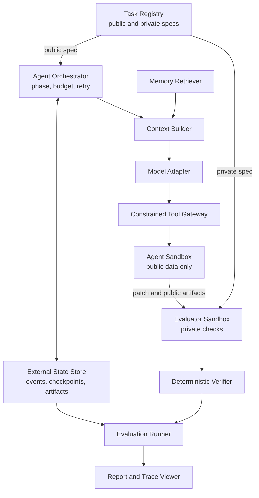
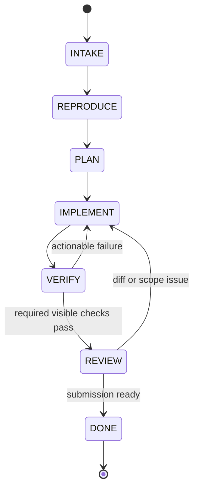

# Architecture

상태: **Normative draft**

## 1. Design principles

- Evaluation boundary를 agent loop보다 먼저 만든다.
- Source state, orchestration state, evaluator secret을 물리적으로 분리한다.
- 모든 중요한 판단은 event, artifact, content hash로 추적 가능해야 한다.
- 자동화 가능한 평가는 deterministic code로 수행한다.
- Recovery는 transcript replay가 아니라 structured state와 idempotent action을 사용한다.
- Provider, database, UI는 교체 가능한 adapter이고 domain contract가 중심이다.

## 2. System context



### Trust boundaries

| Boundary | May access | Must not access |
| --- | --- | --- |
| Agent sandbox | public spec, target repo, visible checks, selected memory | private spec, hidden tests, reference patch, host secrets |
| Evaluator sandbox | submitted patch, clean base repo, private checks | model session, writable agent workspace |
| Orchestrator/state | run metadata, events, artifacts, budgets | hidden test content in model context |
| Report/viewer | sanitized trace and verifier outcome | secrets, hidden assertion bodies, credential values |

Private artifact는 조회 권한을 별도로 표시하며, generic event payload나 model-visible artifact에 복사하지 않는다.

## 3. Components

| Component | Responsibility | Key output |
| --- | --- | --- |
| Task Registry | Immutable task version과 public/private locator 관리 | Resolved task |
| Orchestrator | Phase, transition, retry, budget, stop condition | Phase events/artifacts |
| Context Builder | Transcript 대신 bounded structured context 구성 | Context manifest |
| Model Adapter | Provider 차이를 normalized request/result로 변환 | Model-call event |
| Tool Gateway | Schema, policy, stable action ID 검증 | Tool events/artifacts |
| Agent Sandbox | Repository read/write와 registered check 실행 | Patch/check output |
| State Store | Append-only events, checkpoints, artifact metadata | Durable run state |
| Evaluator | Clean checkout에 patch 적용 후 private 검증 | Verifier results |
| Failure Classifier | Evidence에서 cause/symptom 분리 | Failure record |
| Memory Store/Retriever | Versioned rule 저장, filter/rank/threshold | Retrieval decision |
| Eval Runner | Condition matrix 실행과 provenance 고정 | Raw result rows |
| Reporter | Metric 집계와 task-level evidence 연결 | JSON/CSV/HTML |

## 4. Agent state machine



| Phase | Implemented transition trigger and durable evidence |
| --- | --- |
| `INTAKE` | Validated manifest와 `RunStarted` runtime-contract artifact |
| `REPRODUCE` | Successful non-empty `PatchApplied`; runner가 `PLAN`을 거쳐 `IMPLEMENT`로 전이 |
| `PLAN` | 위 mutation evidence에 결속된 `PhaseChanged`; 별도 plan file은 아직 없음 |
| `IMPLEMENT` | Current-diff visible check 성공 시 `VERIFY`로 전이 |
| `VERIFY` | 모든 required current-diff check 뒤 성공한 `get_diff` |
| `REVIEW` | Complete `get_diff`가 다음 request에 포함되고 `finish_task`가 acceptance를 통과 |
| `DONE` | `SubmissionAccepted`, immutable submitted-patch CAS artifact와 DONE checkpoint |

Invalid transition은 거부하고 event로 남긴다. `DONE`은 evaluator 성공을 뜻하지 않는다. Agent submission이 끝났다는 의미이며, 최종 outcome은 evaluator가 결정한다.

새 v2 run의 phase는 model이 선언하는 상태가 아니라 성공한 tool evidence에서만 전이된다.
`apply_patch`가 실패하면 `REPRODUCE`/현재 phase에 남고, patch 성공은 이전 check와 review를
무효화한다. 현재 diff가 과거 hash로 돌아와도 마지막 `PatchApplied` 이전 evidence는
새 mutation epoch에서 재사용하지 않는다. `run_check`와 `get_diff` 결과에는 exact `worktree_diff_hash`가 들어간다.
현재 diff와 일치하는 non-empty `PatchApplied`가 없으면 base check와 empty `get_diff`가
성공했더라도 제출할 수 없다.
모든 required check의 최신 current-diff 결과가 pass한 뒤 실행된 `get_diff`만 REVIEW
candidate가 되며, 그 complete result가 다음 model request에 실제 포함됐을 때만
`finish_task`가 accepted patch bytes를 CAS에 동결하고 `REVIEW → DONE`을 허용한다.
Evaluator는 mutable workspace를 다시 직렬화하지 않고 그 accepted artifact를 입력으로 쓴다.

## 5. Tool surface

MVP agent-visible tool을 작게 유지한다.

| Tool | Purpose | Important constraint |
| --- | --- | --- |
| `search_files` | literal text 검색 | repository-relative safe glob, result limit |
| `read_file` | line-bounded read | repository-relative path only |
| `apply_patch` | 기존 tracked text file에 raw Git unified diff 적용 | hunk count만 recount; stable action ID, zero-untracked와 path/scope policy 필요 |
| `run_check` | registered check 실행 | arbitrary command 금지, result를 current diff에 결속 |
| `get_diff` | current diff와 size summary 확인 | check 뒤의 final review evidence |
| `finish_task` | final submission control signal | current-diff check와 model-visible final diff review 필요 |

Checkpoint 저장은 runner 내부 동작이며 agent tool이 아니다. `finish_task`도
shell/repository tool이 아니라 orchestrator control action이다.

D-056의 opt-in v3 surface는 위 v2 surface를 그대로 두고 다음 두 도구만 추가한다.

| Tool | Purpose | Important constraint |
| --- | --- | --- |
| `run_probe` | 공개 issue에서 도출한 일회성 Python probe 실행 | `task-public-v2` registered profile + dedicated clean Docker image only, repository read-only, network/secrets 없음, source는 repository 밖 CAS에 보존; optional이고 authoritative check가 아님 |
| `review_task` | 현재 diff에 대한 requirement·targeted validation·residual risk 자기점검 기록 | current-diff check/diff 및 같은 request의 공개 evidence만 인용; inspectable self-attestation이지 grader가 아님 |

`run_probe`는 새 test file을 checkout에 만들지 않고 stdin으로 실행한다. Task evaluator
image를 재사용하지 않는 repository-free `patchloop-sandbox:py312`의 exact image ID를
manifest에 결속한다. Mutable tag는 precheck에만 쓰고 container는 그 immutable ID로
`create`한 뒤 실제 `.Image` equality를 확인해야만 start한다. Nested tmpfs로
`/workspace/.git`을 가려 future commit이나 Git object를 solution shortcut으로 읽지
못하게 한다. Gateway AST policy와 bootstrap audit hook은 흔한 process/native/dynamic
호출을 조기에 거부하는 defense-in-depth이며 Python reflection 자체의 security boundary로
간주하지 않는다. Trusted PID 1은 source를 compile한 뒤 untrusted child를 한 번 fork하고,
그 child에 `no_new_privs`와 seccomp BPF를 설치해 fork/clone/exec, parent signal과 process
trace syscall을 kernel에서 `EPERM`으로 막는다. PID cgroup도 parent+child 두 개로 제한한다.
Proxy 환경을 비우고 trusted parent watchdog·stale-container cleanup을 사용한다. 따라서
target repository의 scope를 늘리거나 patch에 diagnostic file을 남기지 않는다. Local
backend, 미등록 profile, 비정상 `.git` metadata와 image identity 불일치는 start 전에
fail closed한다.
Probe pass는 registered check pass를 대신하지 않고, probe 사용 자체도 제출의 필수조건이
아니다. `review_task`는 `phase-evidence-v6`에서 final `get_diff` 뒤, 같은 diff에 대한
공개 validation evidence를 인용해야 한다. Canonical review 본문과 receipt가 다음
`finish_task` request에 완전하게 제시돼야 제출 가능하지만, review 내용이 옳다는 자기
선언만으로 evaluator verdict를 만들지는 않는다.

Agent-visible `apply_patch`는 model이 만든 hunk header의 old/new line total만 body에서
재계산한다. Patch body 문법, context와 path matching은 Git이 그대로 검사하며
deterministic verifier도 완화하지 않는다. v2는 intent의 검증된 preimage로 policy reject를
rollback하고 pre-call diff hash를 재확인한다. Legacy v1만 같은 raw patch를 reverse
recount한다. Rollback 실패, 복원 불일치 또는 agent workspace의 untracked file은 recovery
error로 run을 중단한다. 이 호환 계층은 agent gateway에만 있으며 hidden evaluator와
fixture evaluator의 patch 적용은 strict하다.

## 6. Persistent state

Logical storage layout은 source repository와 분리한다.

```text
/workspaces/{run_id}/repo
/run-state/{run_id}/events
/run-state/{run_id}/artifacts
/run-state/{run_id}/checkpoints
/evaluator/tasks/{task_version}
```

구현 경로는 OS와 backend에 따라 달라도 이 논리적 분리를 보존해야 한다.

### Durability rules

- Event sequence는 run 안에서 단조 증가하고 unique하다.
- Event append와 해당 action outcome의 durable 기록 순서를 명시한다.
- Checkpoint는 이전 event sequence와 repository/patch hash를 참조한다.
- Artifact는 immutable content hash로 식별한다. 새 object는 같은 directory의 temporary
  file을 fsync한 뒤 atomic replace하고, 기존 object는 재사용 전에 bytes hash를 검증한다.
- 동일 action ID와 input hash의 완료 기록이 있으면 recovery에서 재실행하지 않는다.
- 중단된 action은 tool별 reconciliation 정책으로 completed/failed/unknown을 결정한다.
- Run 전체 lifetime에는 Windows/Linux kernel advisory lock을 하나 유지한다. Lock을 얻은
  worker만 SQLite status를 `RUNNING`으로 claim할 수 있고, 살아 있는 owner와 경쟁한
  resume은 run event/status를 바꾸지 않고 `RUN_OWNERSHIP_CONFLICT`로 끝난다. OS process가
  죽으면 lock은 커널이 해제하며 다음 process는 stale `RUNNING`을 원자적으로 reclaim한다.
- v2 patch는 `ToolCalled(raw patch CAS) → PatchPrepared(pre/post image CAS) → mutation →
  action result/ToolSucceeded/PatchApplied atomic transaction` 순서를 사용한다. Recovery는
  모든 target이 pre면 한 번 적용하고, post면 재적용하지 않으며, mixed면 검증된 preimage로
  baseline을 복원한 뒤 한 번 적용한다. Unknown state나 CAS 손상은 fail-closed한다.
- `read_file`, `search_files`, `run_check`, `get_diff`도 v2에서는 normalized input CAS를
  먼저 기록한다. Outcome 없이 중단되면 workspace가 checkpoint와 정확히 같은지 확인한 뒤
  원래 `ToolCalled`를 재사용해 `ToolSucceeded`/`ToolFailed`로 닫는다. 이미 durable result가
  있는 v2 action을 같은 identity로 다시 호출한 cache hit만 `ToolReplayed`를 남긴다.
- Managed workspace는 정확한 `{workspace_root}/{run_id}/repo` layout, symlink/junction 부재와
  resolved-root containment를 매 recovery 전에 검증한다. Worktree evidence는 staged와
  unstaged tracked 변경을 함께 포함하는 `git diff HEAD`다.
- Evaluator는 manifest/result/provenance와 verifier evidence CAS를 완성한 뒤 hash-bound
  evaluation receipt를 기록한다. 완전한 receipt만 재사용하며, `FailureTagged?`,
  terminal event, result와 status는 한 SQLite transaction으로 확정한다.
- `finish_task`는 correlation별 lifecycle prefix와 durable recovery result를 대조해
  누락 suffix, DONE transition과 checkpoint event만 보충한다.
- `phase-evidence-v3` context builder는 최신 model turn 뒤 rejected `apply_patch`의
  correlated candidate/result CAS를 외부 run state에서 다시 검증하고, exact candidate와
  structured reason을 첫 후속 request에만 넣는다. 이 bytes는 checkpoint나 대상 repository에
  복사하지 않는다. Full request와 output allowance가 token budget을 넘으면 request CAS와
  `ModelGenerationBlocked`를 남기고 provider generation 전에 fail-closed한다.
- `phase-evidence-v4`는 v3를 상속하면서 active mutation epoch의 successful read/search
  input·result CAS를 `investigation-ledger-v1`로 매 turn 재계산한다. Checkpoint에 별도
  mutable ledger를 저장하지 않으므로 context reset과 worker restart가 같은 append-only
  evidence를 다시 소비한다. Exact search와 fully-covered read는 source CAS body를
  `ToolReplayed`로 다시 제시하며 underlying filesystem dispatch를 생략한다.
- V4 tail admission은 남은 model/tool call이 nominal corrective lifecycle에 도달하면
  read/search만 `ToolAdmissionBlocked`로 gateway dispatch 전에 닫는다. Mutation,
  registered check, final diff와 submission action은 이 정책의 차단 대상이 아니다.
- `phase-evidence-v5`는 durable `ModelCalled` telemetry로 token-aware nominal corrective
  tail을 계산한다. 관찰 input은 `requested_input_tokens`를 우선하고 그 값이 `None`일
  때만 actual `input_tokens`로 fallback하며 invalid 값은 fail closed한다. 다음 input은
  `max(observed input) + max(positive consecutive growth)`로 예측한다. 현재 generation이
  기록되기 전에는 5 turn, 기록된 뒤에는 4 turn을 사용하고
  `reserved_tokens = max_output_tokens + projected_next_input × projected_turns`로
  예약한다. `remaining_tokens <= reserved_tokens`이면 read/search만
  `ToolAdmissionBlocked(tool-admission-blocked-v2, reason=token_tail_reserved)`로
  `ToolCalled`와 filesystem dispatch 전에 닫는다. Apply/check/diff/finish는 계속
  사용할 수 있다.
- V5 token cutoff는 completion guarantee가 아닌 nominal policy다. 각 generation 직전의
  strict exact-request + full 25,000 response allowance admission은 그대로 유지되므로,
  cutoff 뒤에도 exact request가 남은 total budget에 맞지 않으면 provider call 없이
  terminal block으로 끝날 수 있다. V5 evidence는 `investigation-policy-v2`,
  `investigation-ledger-v2`, `investigation-tail-policy-v2`,
  `context-build-evidence-v5`, `tool-admission-blocked-v2`,
  `trace-source-evidence-v5`로 versioning하고 qualification envelope은
  `trace-qualification-v2`를 유지한다.
- Opt-in `phase-evidence-v6`는 V5를 상속하고 tool schema v3의 probe/review evidence를
  external run state에 보존한다. Probe source·stdout·stderr와 review input/result는
  content hash로 결속하고 private evaluator artifact를 참조할 수 없다. Final submission은
  same-diff final `get_diff`와 그 결과를 실제로 본 `review_task`, 그리고 review result를
  실제로 본 `finish_task` 순서를 요구한다. 이 경로는 D-056 offline gate가 완료되기 전에는
  provider나 campaign에서 선택할 수 없다.
- D-041 r5에서도 generation admission은 exact input과 full per-call allowance가 남은 total
  budget에 함께 들어가야 한다는 strict rule을 유지한다. 새 exact-request no-generation
  event payload는 `model-generation-block-v1`로 versioning한다. 이 versioned terminal block은 retry
  candidate가 없어도 request, recomputed budget과 terminal result가 모두 결속되면 valid
  trace evidence지만, rejected-patch retry episode 또는 D-037 gate evidence는 아니다.
  Historical unversioned retry block은 읽기 호환하고, unversioned generic r4 block은 당시
  qualification 21/22로 immutable하게 유지한다.
- D-043 r6 controlled diagnostic은 profile v4 manifest에서만 첫
  `PatchPrepared` 뒤 mutation 전 `CONTROLLED_DIAGNOSTIC_REJECTION`을 한 번 만든다. Trigger
  여부는 process memory가 아니라 durable controlled `ToolFailed`에서 판단한다. Prepared
  intent 뒤 process가 죽어도 recovery는 verified pre-state를 적용하지 않고 같은 rejection
  result로 닫는다. 이 branch는 public `inject-fault`와 stress/core 경로에는 노출하지 않는다.

### Recovery algorithm

1. Per-run OS lock을 얻고, 최초 start는 manifest insert와 `CREATED → RUNNING`을 한
   transaction으로 처리한다. Resume은 `CREATED | SUSPENDED | RUNNING → RUNNING` claim을
   원자적으로 남긴다.
2. 마지막 valid event sequence와 checkpoint를 읽는다.
3. Checkpoint가 참조하는 event와 artifact hash를 검증한다.
4. Target repository HEAD와 중단된 patch의 pre/post image를 먼저 대조한다.
5. 중단된 patch가 없다면 generic action 재실행이나 checkpoint 승격 전에 현재
   `git diff HEAD`가 마지막 checkpoint와 정확히 같은지 확인한다.
6. Patch outcome/phase/checkpoint의 누락된 durable suffix를 보충한다.
7. 최종 worktree diff와 checkpoint, submitted patch hash를 비교한다.
8. 현재 phase와 budget을 복원한다.
9. Structured state로 새 context를 만들고 첫 미완료 action부터 실행한다.

## 7. Context construction

각 model call은 다음 section으로 이루어진 bounded context를 받는다.

```text
System policy
Public task specification
Current phase and transition requirements
Persistent task state
Relevant repository context
Current diff
Recent tool evidence
Selected failure memory
Remaining budget
Tool/output schema
```

초기 budget 기본안은 task/policy 15%, state 15%, repo 35%, recent evidence 15%, memory 10%, tool/output schema 10%다. 비율은 development set에서만 조정하고 held-out 전에 고정한다.

## 8. Evaluation path

1. Evaluator는 base commit에서 clean checkout을 만든다.
2. Immutable submitted patch를 적용한다.
3. Hidden acceptance와 regression을 agent와 다른 sandbox에서 실행한다.
4. Diff에서 path, file/line count, dependency, test tampering, API 정책을 검사한다.
5. Sandbox audit에서 safety violation을 검사한다.
6. 각 check를 독립 `VerifierResult`로 저장한다.
7. Primary success bit는 verifier 결과의 deterministic conjunction으로 계산한다.

Evaluator는 agent가 남긴 “통과했다”는 서술을 신뢰하지 않는다.

## 9. Sandbox baseline

```yaml
network: none
cpus: 2
memory: 2g
pids_limit: 128
read_only_root: true
writable_mounts:
  - /workspace/repo
  - /tmp
timeout_seconds: 900
secrets: none
```

Agent image와 evaluator image는 별도 digest로 versioning한다. Hidden task content는 agent image layer, mount, log에 존재해서는 안 된다.

## 10. Failure behavior

- Tool error, timeout, policy rejection을 model-visible structured result와 durable event 양쪽에 남긴다.
- Raw stdout/stderr가 잘리면 `truncated: true`, original byte count, artifact locator를 남긴다.
- V1-v3에서 같은 normalized tool call이 연속 반복되면 advisory loop signal을 발생시킨다.
- 일반 반복은 `LoopDetected(enforcement=advisory)`로, 최근-event window에서 밀려나도
  현재 model turn의 signal을 별도 `execution_signals`에 넣어 다음 context에 제공한다. 동일한
  timed-out registered check는 다시 실행하지 않고 structured environment failure로 종료한다.
- Historical V4는 active mutation epoch 전체에서 비연속 exact search와 interval-union으로 완전히
  덮인 read도 감지한다. `investigation-loop-v1`과 exact semantic replay를 남기며 두 번째
  연속 no-progress부터 strategy change를 요구한다. 새로운 query나 uncovered range를
  hard block하지 않는다.
- Current V5는 위 반복 evidence에 token projection을 더한다. Cutoff 전에는 V4 semantic
  replay 의미를 유지하고, cutoff 뒤 valid read/search는 `token_tail_reserved` evidence로
  admission 단계에서 닫아 tool budget과 filesystem dispatch를 소비하지 않는다.
- 제출 조건 미충족은 `SubmissionRejected`와 model-visible tool result로 돌려주며 두 번까지
  복구할 수 있다. 세 번째 rejection은 deterministic `premature-stop`이다.
- Registered check가 tracked worktree를 바꾸면 `ToolFailed` artifact와 usage를 먼저
  닫은 뒤 infrastructure recovery error로 종료한다.
- 분류할 수 없는 실패를 성공으로 바꾸지 않는다. `UNKNOWN` 또는 review-needed 상태와 evidence를 보존한다.
- Storage failure로 trace integrity를 보장할 수 없으면 run을 성공 처리하지 않는다.

## 11. D-062 corrective runtime boundary

`tool_schema_version=v4`와 `context_policy_version=phase-evidence-v7`은 새 corrective
pilot에서만 pair로 사용한다. Historical v1-v6 run은 소급 재해석하지 않는다.

`corrective-runtime-contract-v1`은 v4/v7 pair, exact system-prompt hash, tool-schema hash와
harness commit을 corrective purpose의 execution hash와 plan에만 조건부로 포함한다. Manifest
validation과 AgentRunner start/resume가 이 contract를 강제하고, qualifier는 unique runner
`RunStarted`가 가리키는 full artifact descriptor, task/role/path와 CAS bytes를 다시 검증한다.
따라서 plan이나 manifest version을 낮춰 새 review/barrier check를 우회하거나 다른 prompt/tool
artifact를 같은 approval로 소비할 수 없다. Historical execution-hash payload에는 이 필드를
추가하지 않는다.

- Context builder는 task ID/version/hash만 보지 않고 각 checklist excerpt가 normalized
  public issue description의 실제 substring인지 다시 검증한 뒤에만 model request에 넣는다.
- Rejected `apply_patch`는 patch CAS와 bounded source snapshot을 다음 apply outcome까지
  유지한다. Successful/rejected next apply가 episode를 닫기 전에는 다른 turn에서도
  candidate/reason이 사라지지 않는다.
- 한 model response의 첫 `apply_patch`는 turn barrier다. 뒤의 모든 call은 dispatch하지
  않고 `ToolAdmissionBlocked(turn-mutation-barrier-v1)`로 닫는다. Apply outcome 뒤 process가
  죽으면 resume이 model response CAS를 검증하고 누락 barrier suffix를 idempotently 보충한다.
- Active mutation epoch에서 exact search/fully-covered read semantic replay가 6회 누적되면
  추가 read/search를 `evidence_saturated`로 닫는다. 새 successful patch가 epoch와 counter를
  reset한다. Apply/check/diff/review/finish는 이 제한의 대상이 아니다.

이 정책은 탐색 비용을 줄이는 condition-neutral runtime 보정이다. Cross-run memory가 아니며
task 성공 또는 completion을 보장하지 않는다.

D-062 live campaign은 승인 execution hash
`sha256:464a6eca2597698ca35caa4d7c97173f1af792daec042c36d81b5b8189ae4031`로 정확히 한 번
실행됐다. 첫 HF Hub run `run_0ccfc8fd359a4785`은 33개 completed model call과 875,908
token을 사용한 뒤 exact-request budget admission에서 종료됐다. Active epoch saturation은
gateway에서 read/search 30회를 차단했지만 v7 context의 `phase_contract.allowed_next_actions`와
`investigation_exploration_admitted`는 token-tail이 닫히기 전까지 read/search를 계속
광고했다. 그 뒤 일곱 raw diff가 모두 preview에서 거부돼 `PatchPrepared`와 `PatchApplied`는
발생하지 않았고 evaluator도 실행되지 않았다. 이 관찰은 saturation enforcement와
model-visible phase contract를 같은 prefix에서 합성해야 한다는 새 version 필요성을
보여주며, v7 rendering을 소급 변경하는 근거가 아니다.

Original campaign result, hash-chained journal과 qualification artifact는 immutable하다.
Original qualification failure로 campaign이 fail-closed했기 때문에 나머지 PDM/pyfakefs
row는 시작되지 않았고 original gate는 false다. 독립 분석에서 qualifier의 v5-vs-v6/v7
reserve-version drift가 분리됐고, 별도 `trace-qualification-correction-v1`
`qcor_8b6ff812...4870b6`가 corrected trace integrity를 통과했다. Canonical qualification과
campaign result는 수정하지 않았으므로 original gate와 task outcome은 그대로다.
D-062는 계속하거나 재실행하지 않는다. 다음 architecture gate는 새 `phase-evidence-v8`
saturation-context 계약을 offline에서 검증한 뒤 별도 승인된 single live pilot으로 확인하는
것이다.

## 12. D-063 saturation-context boundary

`phase-evidence-v8`은 D-062에서 관찰된 gateway/context 불일치만 분리해 수정한다. Tool
surface와 prompt는 각각 `tool_schema_version=v4`, `SYSTEM_PROMPT_V5`를 그대로 사용하고,
model-visible phase contract만 `phase-contract-v3`로 올린다. Historical v7 request와
qualification은 다시 렌더링하지 않는다.

V8 context builder는 durable event prefix에서 마지막 successful `PatchApplied`를 active
mutation epoch로 잡고, 그 뒤의 `ToolReplayed(semantic_replay=true)`를 센다. 이 값과 기존
token/model/tool tail 정책을 다음 `read_search_policy`로 합성한다.

```json
{
  "schema_version": "read-search-policy-v1",
  "policy_version": "evidence-saturation-v1",
  "admitted": false,
  "reason_codes": ["evidence_saturated"],
  "semantic_replay_count": 6,
  "semantic_replay_threshold": 6,
  "mutation_epoch_sequence": null
}
```

Tail reason을 먼저 기록하고 replay count가 6 이상이면 `evidence_saturated`를 뒤에 붙인다.
Saturation만 활성화되면 `read_file`과 `search_files`만 authoritative
`allowed_next_actions`에서 제거하고 registered `run_probe`는 유지한다. Tail이 닫히면 기존
정책대로 read/search/probe를 모두 제거한다. Patch apply가 성공해 epoch가 바뀌면 count를 0으로
재계산하고 read/search를 다시 열며, rejected/failed patch와 probe는 reset으로 세지 않는다.

Gateway hard block은 계속 최종 authorization boundary다. V8의 목적은 고정 provider tool
schema를 동적으로 바꾸는 것이 아니라, 다음 request에 보이는 phase contract를 같은 durable
prefix에서 계산한 gateway 판단과 일치시키는 것이다. Runtime descriptor는
`corrective-runtime-contract-v2`, context evidence는 `context-build-evidence-v8`, source
evidence는 `trace-source-evidence-v8`을 사용한다.

이 version은 우선 mock/offline opt-in으로만 생성할 수 있다. OpenAI/replay provider와
experiment context는 fail closed하며, live pilot purpose·suite·execution hash·비용 승인은 이
offline gate와 별도의 후속 변경이다.

D-063 offline E2E는 여섯 semantic replay 직후 process가 중단된 상태에서 새 runner가 같은
durable prefix를 resume하도록 강제했다. Resume의 첫 context는 read/search를 제거했고,
successful patch 뒤 다음 context는 replay count 0과 새 epoch로 탐색을 다시 열었다. 같은 run의
`saturation_context_contract`도 통과해 runner, state store, context artifact와 qualifier를 한
경로로 연결했다. 이 결과는 live model 행동이나 task 난이도에 대한 evidence가 아니다.
